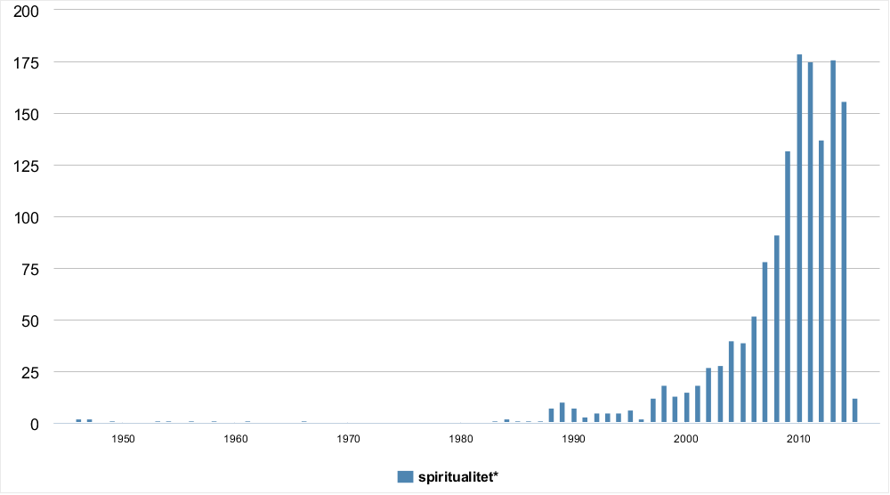
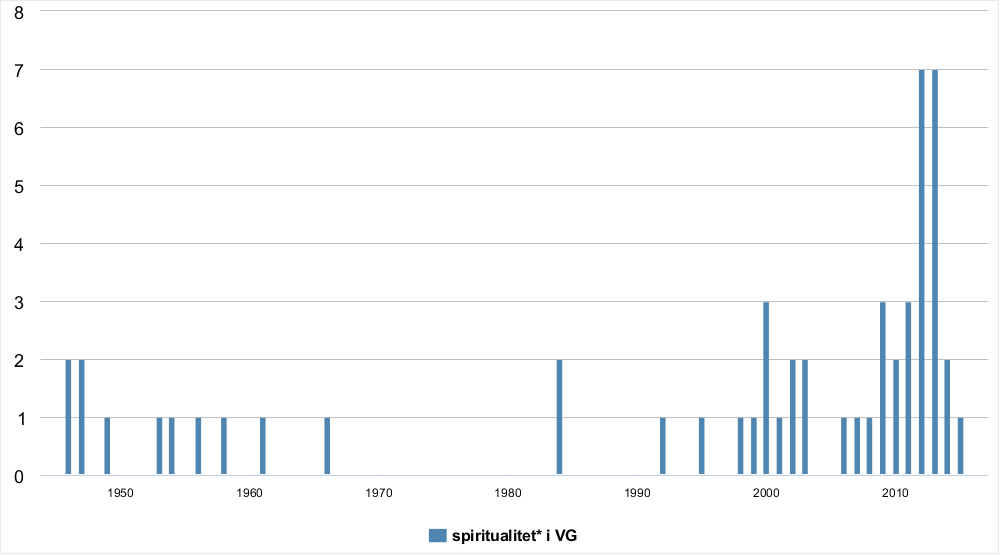
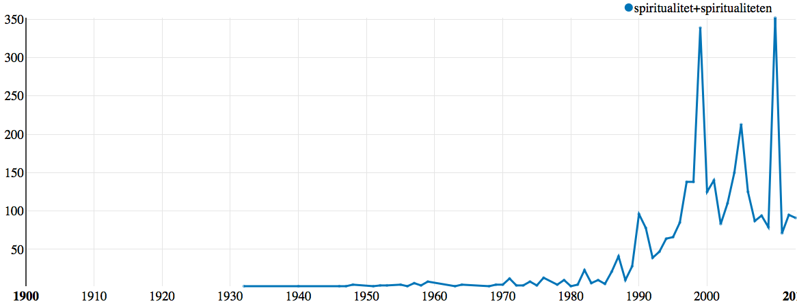
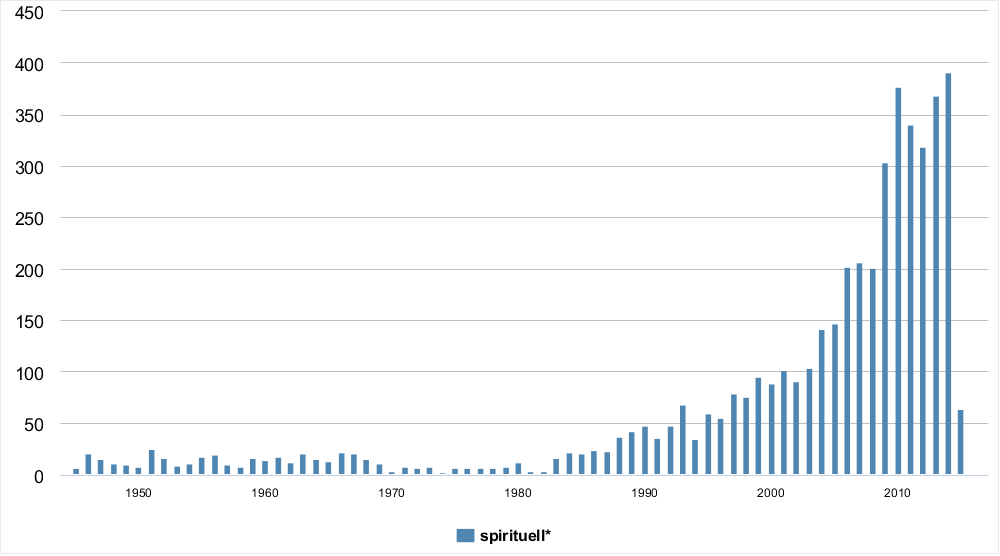
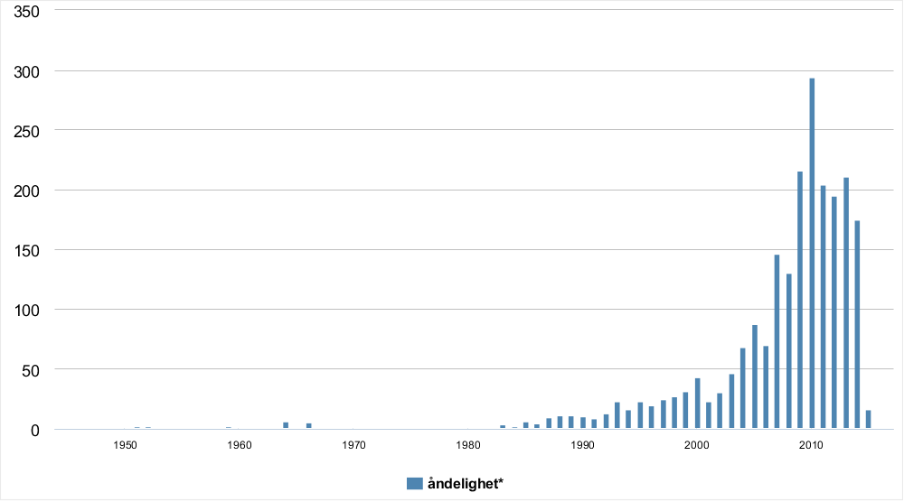

# 1950–2015: Engler, New Age og ikke-religion

Hva karakteriserer spiritualitetsklyngen i norske aviser fra 1950-tallet til i dag?

I denne delen vil jeg først presentere datagrunnlaget og noen tendenser for hele perioden samlet. Vi skal se på spiritualitetsklyngen med utgangspunkt i variasjoner i leksemet, inkludert samskrivinger (for eksempel «New Age-spiritualitet»).

## Tidsserier

Det som følger er en oversikt over forekomster av spiritualitetsklyngen i de ulike tekstkorpusene over tid. Det er viktig å påpeke at i første omgang reflekterer dette først og fremst antall forekomster i datamaterialet fordelt på år, og ikke en forholdsmessig bruksfrekvens. I Atekst er det for eksempel flere tilgjengelige søkekilder fra og med 90-tallet.

Det disse tidseriene først og fremst viser er derfor hvor mye tilgjengelig kildemateriale vi har fordelt på tidsperiodene.

### Spiritualitet*

#### Atekst

#### Nasjonalbiblioteket

#### Norsk Aviskorpus ####

#### KWIC ####

##### 1945–1949 #####

|                                     venstre |    nøkkelord    | høyre                                |
| ------------------------------------------: | :-------------: | :----------------------------------- |
|              Øverland, og han sakner dennes | _spiritualitet_ | og bitende vidd. Men de              |
| kabaretvelformede og måteholdnemen uten den | _spiritualitet_ | rikdom og oppfinnsomhet som aftenens |
|           de vanlige teatre. Humor, satire, | _spiritualitet_ | i videste forstand, som kan          |
|                      vål av den elegans och | _spiritualitet_ | varmed Lamm formått sammanfora ett   |

I perioden 1945 til 1949 finner vi i VG kun fire eksempler på bruk av _spiritualitet_. I alle tilfellen inngår nøkkelordet i en form for liste eller sammenligning. En av disse frasene er på svensk og stammer fra Anita Ohlon Olson bokomtale av _Det moderne dramat_ av Martin Lamm (VG, 21.10.1949). «Spiritualitet» knyttes her til frase som «bitende vidd», «rikdom», «oppfinnsomhhet», «humor», «satire» og «elegans». Alle disse konkordansene finnes i tekster som omtaler enten litteratur eller teater. De viser også til en kvalitet til enten en person (for eksempel Arnulf Øverland, Kari Diesen) eller til en estetisk sjanger (revyen) eller en beskrivelse av en persons (Marit Lamm) åndsverk (_Det moderne dramat_).

##### 1949–1961

|                           venstre |    nøkkelord    | høyre                      |
| --------------------------------: | :-------------: | :------------------------- |
|      (han gjør det med henrivende | _spiritualitet_ | og Daniel Gelin og Anne    |
|              ikke fins nok ånd og | _spiritualitet_ | ta å fylle en dukkes       |
| Suitegikk med fornøden applomb og | _spiritualitet_ | Mer krevende er Jo Handels |

Det er kun tre konkordanser med nøkkelordet _spiritualitet_ mellom 1949 og 1961 i VG. Her står to med en sammenligning med termer som «ånd» og «fornøden applomb»\[sic\].[^applomb]

[^applomb]: _Fornøden_ betyr «nødvendig», fra tysk _vonnöten_. _Aplomb_ betyr «kraft, sikkerhet i holdning el. opptreden», fra fransk _à plomb_.

##### 1961–1975
|                   venstre |    nøkkelord    | høyre                 |
| ------------------------: | :-------------: | :-------------------- |
| USA, hvor han bevarte sin | _spiritualitet_ | men matte finne seg i |

På seksti- og begynnelsen av syttitallet finner vi kun én konkordanse. Her brukes begrepet om den franske filmregissøren Rene Clair og impliserer en kvalitet hos han som filmskaper som vedvarer, underforstått, selv om han oppholder seg i USA (under Andre verdenskrig). Ser vi videre etter konkordansen, «men måtte finne seg i at hans ytre form ble nokså strømlinjeformet og hard», ser vi også at her stilles begrepet spiritualitet opp som en motsetning til begreper som «strømlinjeformet» og «hard».

##### 1975-1987
|                            venstre |    nøkkelord    | høyre                          |
| ---------------------------------: | :-------------: | :----------------------------- |
|         seg like kostelig over all | _spiritualitet_ | på deres bekostning, heter det |
| man betaler for, don profesjonelle | _spiritualitet_ | Britene or kjent for on        |
|            ikke finnes mer And og: | _spiritualitet_ | enn til å fylle en             |
|  viljen har sjelens "åndighet" (la |  _spiritualite_ | de son ame) sitt sete,         |
|        - inspirert og engasjert av | _spiritualitet_ | og mystikk.© Aftenposten       |

##### 1987–1990
|                                              venstre |     nøkkelord     | høyre                                 |
| ---------------------------------------------------: | :---------------: | :------------------------------------ |
| autoritetsbegrepet, russisk åndsliv og greskortodoks |  _spiritualitet_  | - Brynhildsen hadde en oppgave        |
|                      prosa er forsvunnet: humoren og | _spiritualiteten_ | de dramatiske scenene og de           |
|                   den karismatiske og den liturgiske |  _spiritualitet_  | - Kristusmystikken er en fromhetsform |
|                   ønsker å fremme en Kristussentrert |  _spiritualitet_  | som et kristent motstykke til         |
|                          ikke lokke Kristina med sin |  _spiritualitet_  | Derimot gjorde hun inntrykk med       |
|               Oslo. Dominikanersøstrene har sin egen |  _spiritualitet_  | som er kjennetegnet ved utadvendt     |
|                             i "Morgendemring - en ny |  _spiritualitet_  | og av Karsten Isachsen i              |
|                          bok, "Morgendemring - en ny |  _spiritualitet_  | Det kom fra en norsk                  |
|                          bok, "Morgendemring - en ny |  _spiritualitet_  | med expresten hjertelig tilstede (i   |
|                           bok "Morgendemring - en ny |  _spiritualitet_  | heter det i invitasjonen som          |
|                           bok "Morgendemring - en ny |  _spiritualitet_  | Efterpå blir det en samtale.          |
|                   min tittelen "Morgendemring -en ny |  _spiritualitet_  | sa Helge Hognestad, og presenterte    |
|                     gjensynet med en savnet sproglig |  _spiritualitet_  | Hans store formidlingsinnsats som vår |

##### 1990-1993
|                                            venstre |     nøkkelord     | høyre                                   |
| -------------------------------------------------: | :---------------: | :-------------------------------------- |
|        alternativer til voldsøkonomier og sterkere |  _spiritualitet_  | - hvor den enn kommer                   |
|                         tone visste å gi sydlandsk |  _spiritualitet_  | fulgte Lutoslawskis "Musique funébre" , |
| lønnsomhetsoptimismen. Andre strømninger i kristen |  _spiritualitet_  | går under navnet "miljøteologi" .       |
|                  Sentre, grupper og fellesskap for |  _spiritualitet_  | og vekst oppstår for tiden              |
|                       sunne sans. Sjelen, den egne | _spiritualiteten_ | eget og uformidlet innsyn i             |
|                       sunne sans. Sjelen, den egne | _spiritualiteten_ | eget og uformidlet innsyn i             |
|     Tsjaikovskijs Rokokkovariasjoner bærer preg av |  _spiritualitet_  | og varme, som vi kjenner                |
|                          fra Gulag og den russiske |  _spiritualitet_  | makter på dette punkt å                 |
|                            et senter i Brüssel for |  _spiritualitet_  | og kultur i Europa. Mette               |
|                            om både en grønn okkult |  _spiritualitet_  | der utøverne bidrar til å               |

##### 1993–1995
|                                         venstre |    nøkkelord    | høyre                                    |
| ----------------------------------------------: | :-------------: | :--------------------------------------- |
|                         et senter i Brussel for | _spiritualitet_ | og kultur i Europa.© Aftenposten         |
|                        arbeider i et senter for | _spiritualitet_ | og kultur i Brussel. Mette               |
|                        arbeider i et senter for | _spiritualitet_ | og kultur i Brussel.© Aftenposten        |
|                     er forbauset over den store | _spiritualitet_ | som lever i disse bilder,                |
|                 (1984) og "Morgendemring. En ny | _spiritualitet_ | (1989). 16. august utkom hans            |
|                   singelen "Secret", en sang om | _spiritualitet_ | og selvrealisering. Singelen blir utgitt |
| kombinerer pengegrapsing og klansmentalitet med | _spiritualitet_ | Du skal vera glad til                    |
|        også Emmaus-senteret arbeide med kristen | _spiritualitet_ | I møtet med andre religiøse              |
|                    språk med et fritt sinnelag; | _spiritualitet_ | bevegelighet og eleganse med en          |

##### 1995-1997
|                                     venstre |     nøkkelord     | høyre                                            |
| ------------------------------------------: | :---------------: | :----------------------------------------------- |
|                 et oppkomme av livsglede og |  _spiritualitet_  | Under fangetiden i Tyskland, som                 |
|              Emmaus (prosjekt for dialog og |  _spiritualitet_  | holde et kåseri med lysbilder                    |
|                    har mye av den aztekiske | _spiritualiteten_ | i seg. Men de hører                              |
|            Leder kurset "Klovning som leken |  _spiritualitet_  | i helgen.Bildetekst: Kontaktskapende. Når Didier |
|                         - Det er en særegen |  _spiritualitet_  | over alt Mehren gjør. I                          |
| selvsagt filosofere litt over dødelighetens |  _spiritualitet_  | i det han tilbyr blodpengene,                    |

##### 1997–1999
|                                          venstre |     nøkkelord     | høyre                                      |
| -----------------------------------------------: | :---------------: | :----------------------------------------- |
|                      Andre religioner så vel som |  _spiritualitet_  | av ulike typer er "hett                    |
|                            et sted for Dialog og |  _Spiritualitet_  | har dialog-kveld i Nykirken kl.            |
|               Pilegrimen finner sider ved Østens |  _spiritualitet_  | som fascinerer ham og samtidig             |
|                            et sted for dialog og |  _spiritualitet_  | har dialogkveld i Nykirken kl.             |
|              under en markedsdag i Bogstadveien? |  _Spiritualitet_  | handler vel ikke om å                      |
|                        komiske. Det har også med |  _spiritualitet_  | å gjøre. Og så har                         |
|             og forskerseminarer som «Religion og |  _spiritualitet_  | i Barenstregionen» i mai og                |
|                            et sted for dialog og |  _spiritualitet_  | og et møtested for mennesker               |
|                    er sjelden. En slags politisk |  _spiritualitet_  | der han opphever avstanden mellom          |
|                som foretrekker den anonymitet og |  _spiritualitet_  | som Internett tilbyr, mener han:           |
|                       hjulpet av en dirigent med |  _spiritualitet_  | oversikt og evne til å                     |
|                      mennesker spør etter liv og |  _spiritualitet_  | sier Stålsett. - Hvordan har               |
|                            holdning til å be, en |  _spiritualitet_  | som utfordrer vår egen religiøse           |
|                Sangen preges av en middelaldersk |  _spiritualitet_  | i måten han bruker øynene                  |
| ytringsfrihet forkrøples menneskets åndsevner og |  _spiritualitet_  | Uten ytringsfrihet fratas mennesket en     |
|                  av Bibelen og den fransiskanske | _spiritualiteten_ | - Jeg har studert kristendom               |
|                            et sted for dialog og |  _spiritualitet_  | har meditasjonskvelder i Nykirken hver     |
|                           for godt. Det er ordet |  _spiritualitet_  | Begynner vi å bruke disse                  |
|                    er autoriteten myknet opp med |  _spiritualitet_  | I heraldikken er blått oppriktighetens     |
|  helse, global bevissthet, miljø, selvutvikling, |  _spiritualitet_  | alternativ medisin og nye utviklingsveier. |
|                  oppfatter valgene og formen for |  _spiritualitet_  | i de fleste innlegg på                     |

##### 1999-2001
|                                                  venstre |     nøkkelord     | høyre                                                |
| -------------------------------------------------------: | :---------------: | :--------------------------------------------------- |
|                                  sper gjerne på med litt |  _spiritualitet_  | og vips: vi har nye                                  |
|                      Naturmedisin, religion og mytologi, |  _spiritualitet_  | , selvutvikling som inkluderer menneskets _åndelige_ |
|                        foreldretreff - for å demonstrere |  _spiritualitet_  | og sann interesse for alternativ                     |
|                              på uvanlige steder etter en |  _spiritualitet_  | som faktisk kan bety noe                             |
|                                  et samfunn der kropp og |  _spiritualitet_  | kan kjøpes og selges. I                              |
|                        personlige notater om religion og |  _spiritualitet_  | Aftenposten                                          |
|              inn tax-free-posens sprit mot meditasjonens |  _spiritualitet_  | Hun sier hun er karma-konsulent,                     |
|                                "På vei mot en universell |  _spiritualitet_  | Å ta vare på seg                                     |
|                                    - Det er mye følelse, |  _spiritualitet_  | melodi, euforie og melankoli i                       |
|        enn programmerere.HISTORIER, FØLELSER, VERDIER OG |  _SPIRITUALITET_  | er det viktigste i den                               |
|               for Presteforeningens utdannelse i kristen |  _spiritualitet_  | og retreat-arbeid. 75 år I                           |
|                    BigBang hever låta med soulforløsende |  _spiritualitet_  | og øs. De tre andre                                  |
|                             Emmaus, senter for dialog og |  _spiritualitet_  | og nabo til moskeen i                                |
|                         erkjenne sitt følelsesliv og sin |  _spiritualitet_  | Dette kan være eksempel på                           |
|                                        har lag på lag av |  _spiritualitet_  | Det ser ut til å                                     |
|                        en estetisk innlevelse og kritisk |  _spiritualitet_  | som henrykket generasjoner av studenter.             |
|                                     er berørt av den nye | _spiritualiteten_ | frestår Kirken som en religiøs                       |
|                        Tekstene kretser mellom hans egen |  _spiritualitet_  | og en humanistisk pragmatisme. Han                   |
|                       SunnivaStudenthjem - en samling om | _spiritualiteten_ | fra Taize.Alle samlingene er åpne                    |
|                synger om universelle verdier kjærlighet, |  _spiritualitet_  | og stoltheten over sin opprinnelse                   |
|                 mangler låtrikdommen og den suggererende | _spiritualiteten_ | hun hadde for fem år                                 |
|                              gjennom mange år vært ladet |  _spiritualitet_  | skriver dr. Michael Tucker i                         |
|                              New age og den fremvoksende | _spiritualiteten_ | og avrundes i morgen kveld                           |

##### 2001–2002
|                                     venstre |      nøkkelord     | høyre                                   |
| ------------------------------------------: | :----------------: | :-------------------------------------- |
|              sin egen guddommelige kraft og |   _spiritualitet_  | Lysvesenet Morten Eriksen er opptatt    |
|                      vest - om den keltiske |  _spiritualiteten_ | er tittelen på en sang-                 |
|                  derfor ikke forstå en viss |   _spiritualitet_  | om vi ikke kjenner de                   |
|             sterkt element av mystisisme og |   _spiritualitet_  | i filmen, som ein kan                   |
|                        en roman om moral og |   _spiritualitet_  | - Det å tenke på                        |
|                         ved seg selv og sin |   _spiritualitet_  | Nancy og Johnny Tom Russell             |
|                   løkås Det handler om både |   _spiritualitet_  | og dans. Men mest av                    |
|   historien de forteller. Drømmer, eventyr, |   _spiritualitet_  | og følelser dominerer fremfor teknologi |
| oppleve middelalderens musikk, mystikere og |   _spiritualitet_  | imøte med urban samtid. Det             |
|           opmærksomhed - træk av Ignatiansk |   _spiritualitet_  | Jeg skjønner godt hvorfor nonnene       |
|          teologi, men oppmuntring, hjelp og |   _spiritualitet_  | til å kunne leve, sier                  |
|   afghanske, med mangfoldet, mystisismen og |  _spiritualiteten_ | - Men håp? Jeg vet                      |
|                   årene er bøker om katolsk |   _spiritualitet_  | og mystikken. Bøker som har             |
|    Swept» videreføres både aggressivitet og |   _spiritualitet_  | fra hennes tidligere album. Det         |
|                  verden, både med musikk og |   _spiritualitet_  | Han var alltid en meget                 |
|                    Det handler om livet ved | _spiritualitetens_ | kilder. For som han selv                |
|           har tatt utgangspunkt i begrepene |   _spiritualitet_  | og musikk. Dette vil bli                |
|    «Ganges Groove», men platas overhengende |   _spiritualitet_  | (sjamanistisk?) er saktens sjenerøs nok |
|      symboler på henholdsvis moderlighet og |   _spiritualitet_  | Igjen høres det unektelig ut            |
|              om meditasjon, yoga, thai chi, |   _spiritualitet_  | og selvutvikling, sier Audhild Årøen.   |
|                        har ikke noe med min |   _spiritualitet_  | å gjøre. Jeg går ikke                   |
|            på gravsteiner. Engler: Står for |   _spiritualitet_  | og vokter graven, rettleder sjelen,     |
|            "Sexually speaking", om kjønn og |   _spiritualitet_  | - Han skrev noen romaner                |
|  utforske Middelalderens musikk, mystikk og |   _spiritualitet_  | i møte med urban samtid.                |
|  utforske Middelalderens musikk, mystikk og |   _spiritualitet_  | i møte med urban samtid.                |
|                   og urner Engler: Står for |   _spiritualitet_  | og vokter graven, rettleder sjelen,     |
|              for mer alternative livssyn og |   _spiritualitet_  | - Studentene må gjerne skape            |
|             basert på familieomsorg og sams |   _spiritualitet_  | anten religiøsiteten er uttrykk for     |
|           platen av den søkende, zen-aktige |  _spiritualiteten_ | som var et gjennomgangstema i           |

##### 2002–2004

|                                              venstre |     nøkkelord     | høyre                                            |
| ---------------------------------------------------: | :---------------: | :----------------------------------------------- |
|                av kvarandre. Spørsmålet om kvinneleg |  _spiritualitet_  | handlar om å leita fram                          |
|                   et nært fellesskap med tidebønner, |  _spiritualitet_  | og kommunitet. Vinh er ikke                      |
|         Men forbrukersamfunnet selger også kunnskap, |  _spiritualitet_  | japanske hager, og, som i                        |
|          har atskillige undersøkelser av heksekraft, |  _spiritualitet_  | og åndetro blant nigerianere bak                 |
|                          med tema hentet fra kristen |  _spiritualitet_  | Samlingene er åpne for alle                      |
|      norrøn middelalderdikting. - Diktet tydeliggjør | _spiritualiteten_ | i tiden omkring erkebispesetets opprettelse      |
|                           det så spennende med denne | _spiritualiteten_ | som vokser frem i dag.                           |
|       en festivalutstilling med middelaldermusikk og |  _spiritualitet_  | som tema. Åpningskonserten blir med              |
|                      ukjente. Se hvordan nostalgi og |  _spiritualitet_  | er nedfelt i folkekulturen, i                    |
|                    buddhistmiljø». - Når det gjelder |  _spiritualitet_  | og meditasjon, sier Goldie alvorlig;             |
|                    buddhistmiljø". - Når det gjelder |  _spiritualitet_  | og meditasjon, sier Goldie alvorlig;             |
|                                Jeg tror at hvis ikke |  _spiritualitet_  | er en del av livet                               |
|                          som snakker om tradisjon og |  _spiritualitet_  | og det rike mangfoldet i                         |
|                         boken «Morgendemring - en ny |  _spiritualitet_  | hvor han blant annet hevdet                      |
|                     en felles historie, identitet og |  _spiritualitet_  | Det handler om kirken som                        |
|                     en felles historie, identitet og |  _spiritualitet_  | Det handler om kirken, som                       |
|                     danne utgangspunkt for en felles |  _spiritualitet_  | Vi er i ferd med                                 |
|                        helt avgjørende å feste denne | _spiritualiteten_ | til filmrullen. Det er også                      |
|                        våge stillhet. Å bruke Taizés |  _spiritualitet_  | Fortsetter å synge "Han har                      |
|                        bøker med hovedvekt på kristen |  _spiritualitet_  | og _åndelig_ veiledning, fra norske              |
|                   fra miljø hvor tradisjonell samisk |  _spiritualitet_  | ennå har en sterk stilling.                      |
|                               kroppen er å nekte dem |  _spiritualitet_  | Info: www.uscobm.com/ * Opplev religionen        |
|            lynglimt på en pressekonferanse: Kraften, | _spiritualiteten_ | og besluttsomheten i skrittene på                |
|                 han representerte en savnet språklig |  _spiritualitet_  | og han ble rost for                              |
|                    dyttet stadig nærmere hyllene for |  _spiritualitets_ | selvhjelps- og alternativlitteratur. Likevel har |
|                       banalt om man evalurerer denne |  _spiritualitet_  | ut fra underholdningsverdi. Noe helt             |
|                         om kristen tro, tradisjon og |  _spiritualitet_  | Hilde Dagfinrud Valen innleder til               |
|                         om kristen tro, tradisjon og |  _spiritualitet_  | Hilde Dagfinrud Valen innleder til               |
|                     seminarer, blant annet om samisk |  _spiritualitet_  | i kirken og om samisk                            |
|      deriblant globalisering og økonomisk utvikling, |  _spiritualitet_  | og kulturelt mangfold og medier.                 |
|    det fortsatt være mye tungen-ut-av-norske-munner! |  _Spiritualitet_  | Nå må vi ta oss                                  |
|                         ethvert tilløp til empati og |  _spiritualitet_  | Det er nok ikke tilfeldig                        |
|                         ethvert tilløp til empati og |  _spiritualitet_  | Det er nok ikke tilfeldig                        |
|                   holdning til religion, politikk og |  _spiritualitet_  | Si fra til oss! Vi                               |
| Levinas' fundamentaletikk fornyer den jødisk-kristne |  _spiritualitet_  | NÅ TIL SELVE FORTELLINGEN: Mesteren              |
|                                av leger. Og bøker om |  _spiritualitet_  | og _åndelighet_ som er en bro                    |

##### 2004–2005

|                                                           venstre |     nøkkelord     | høyre                                           |
| ----------------------------------------------------------------: | :---------------: | :---------------------------------------------- |
|                                               i stand ei form for |  _spiritualitet_  | som kan stå imot den                            |
|                                               i stand ei form for |  _spiritualitet_  | som kan stå imot den                            |
|                                      eldgamle bønnene i den orto- |  _Spiritualitet_  | Ortodoksien er realistisk samstundes som        |
|                                    at egen stolthet og verdighet, |  _spiritualitet_  | og kulturell egenart, religiøse erfaringer      |
|                                     henger sammen med behovet for |  _spiritualitet_  | Blake har vært gjenstand for                    |
|                                     har Holistisk Forbund møte om |  _Spiritualitet_  | og Religion i Katedralen på                     |
|                                          må åpne opp, det mangler |  _spiritualitet_  | Et eldgammelt tankegods vi må                   |
|                                     country mot hiphop; kirke mot |  _spiritualitet_  | gifte kvinner mot single kvinner;               |
|                                     country mot hiphop; kirke mot |  _spiritualitet_  | gifte kvinner mot single kvinner;               |
|                               ved fornyet interesse for religion, |  _spiritualitet_  | moral og visjoner. OL-søknaden kan              |
| lingvistisk fremmedgjøring, angeliske assosiasjoner, Shakespearsk |  _spiritualitet_  | og KGB-etterretning. Navnene indikerer stykkets |
|                           en nødvendig motsetning mellom inderlig |  _spiritualitet_  | og økonomisk gevinst. Men som                   |
|                                         og spiller. & er "Keltisk |  _spiritualitet_  | tema for foredraget i "Forum                    |
|                                     avsluttet jakten på genet for |  _spiritualitet_  | ville det vært fint hvis                        |
|                                       mer plass til den sanselige | _spiritualiteten_ | som kvinnene trekkes mot. Det                   |
|                                       mer plass til den sanselige | _spiritualiteten_ | som kvinnene trekkes mot. Det                   |
|                              dette i sjølve den russisk-ortodokse | _spiritualiteten_ | der det åndelege lever i                        |
|                     den forbindelse Presteforeningens utdanning i |  _spiritualitet_  | Ole Nordhaug er utdannet ved                    |
|                                   eposet kjennetegnes av humor og |  _spiritualitet_  | og av en virtuos verseføring.                   |
|                forbindelse Presteforeningens utdannelse i kristen |  _spiritualitet_  | 70 år Ambassadør Ketil Børde,                   |
|                           det dilemmaet. Fascinasjonen for østlig |  _spiritualitet_  | til tross, er det Europa                        |
|                                     lukt av jord - materialistisk |  _spiritualitet_  | til en gammel nonnevenninne han                 |
|                                         have fyldt hendes liv med |  _spiritualitet_  | EKSTRA BLADET© Bergens Tidende                  |
|                                         var preget av en spesiell |  _spiritualitet_  | som han forbandt med helgenkongen,              |
|                                         var preget av en spesiell |  _spiritualitet_  | som han forbandt med helgenkongen,              |
|                                                Han var en mann av |  _spiritualitet_  | etikk og rettferdighet. Jeg håper               |
|                   Tittelen på licentiatavhandlingen er «Kroppslig |  _spiritualitet_  | en religionspsykologisk studie av ekstatiske    |
|                                individets forhold til renselse og |  _spiritualitet_  | Selv om Ingvild Wærhaugs interiør               |
|                         over avhandlingen «Spenninger, syntese og |  _spiritualitet_  | i norsk UFO-bevegelse, særlig eksemplifisert    |
|                                            titusener av unge i en |  _spiritualitet_  | som konsentrerer seg om en                      |
|                           utsagnet fører til følgende frigjørende |  _spiritualitet_  | Det største er ikke å                           |
|                               skulle det være alternativmesse med |  _spiritualitet_  | reinkarnasjon og felles healing. Og             |
|                                 økt interesse i religionen, eller | _spiritualiteten_ | som de også kaller den.                         |
|                                        trakk de som lengtet etter |  _spiritualitet_  | og stillhet ut i ørkenen.                       |
|                                           man slik - i apostolisk |  _spiritualitet_  | - kan det tenkes at                             |
|                              trenger det. Så inderlig. Apostolisk |  _spiritualitet_  | er dette: «Vær med å                            |
|                             selv. Religion blir pådyttet utenfra. |  _Spiritualitet_  | er omgitt av en aura                            |

##### 2005-2007

|                                                          venstre |        nøkkelord       | høyre                                         |
| ---------------------------------------------------------------: | :--------------------: | :-------------------------------------------- |
|                           dr. art-graden "Spenninger, syntese og |     _spiritualitet_    | i norsk UFO-bevegelse, særlig eksemplifisert  |
|                                  tilsier, vil kjenne igjen Mimis |     _spiritualitet_    | ­ Med en utbredelse av                        |
|                                  tilsier, vil kjenne igjen Mimis |     _spiritualitet_    | Med en utbredelse av synet                    |
|                            en mild, velduftende, lett blodfattig |     _spiritualitet_    | hviler i lufta, og lav                        |
|                               spille på intelligens, dannelse og |     _spiritualitet_    | Det er krevende og utfordrende.               |
|                               spille på intelligens, dannelse og |     _spiritualitet_    | Det er krevende og utfordrende.               |
|                                        side. Pakket med patos og |     _spiritualitet_    | er den de foregående koreografienes           |
|                               annet moteriktig uttrekk av østlig |     _spiritualitet_    | omskapt, tilpasset, rykket ut av              |
|                                       harens år (f.eks. 1975). n |     _Spiritualitet_    | sjarm, samarbeid. n Finanssektoren, pressen,  |
|                                               Vi må ha plass til |     _spiritualitet_    | og kontemplasjon i teateret ­                 |
|                                               Vi må ha plass til |     _spiritualitet_    | og kontemplasjon i teateret hvor              |
|                       mellom norsk tradisjon og cisterciensernes |     _spiritualitet_    | Reformasjonen i 1537 førte til                |
|                     pastoralklinisk utdanning, studier i kristen |     _spiritualitet_    | og visuell kunst. Jubilanten er               |
|                            rolige overflaten bobler lidenskap og |     _spiritualitet_    | akkurat som i musikken hennes.                |
|                           erfaringer. Den rekonstruerer en falsk |     _spiritualitet_    | mener Nyeng. ­ Jeg mener                      |
|                           erfaringer. Den rekonstruerer en falsk |     _spiritualitet_    | mener Nyeng. Jeg mener vi                     |
|                                  stiller spørsmål om religion og |     _spiritualitet_    | Han er svært opptatt av                       |
|                                     egen plass på jorden, snakke |     _spiritualitet_    | Jeg tror ikke filmen vil                      |
|                                        et sted for meditasjon og |     _spiritualitet_    | for «New age-overklassen». Den svenske        |
|                                        bunnen. Du kan ikke oppnå |     _spiritualitet_    | uten hengivenhet, selvdisiplin, studier. Fred |
|                              først forbinder med _åndelighet_ og |     _spiritualitet_    | Tenk om igjen. Det er                         |
|                              med sin mystikk, styrke, skjønnhet, |     _spiritualitet_    | energi og alt annet vi                        |
|                              med sin mystikk, styrke, skjønnhet, |     _spiritualitet_    | energi og alt annet vi                        |
|                                   THE TELEGRAPH. SITAT «Den dype |    _spiritualiteten_   | er i indernes DNA. For                        |
|                                      vært opptatt av religion og |     _spiritualitet_    | Mandag besluttet arrangørene av gallaen       |
|                                    som eitt av denne alternative |    _spiritualiteten_   | sine mest markante trekkEin heil              |
|                          egne 3D-verdener for chat), Dotsoul.net |     _spiritualitet_    | og drømmer). *** Kom i                        |
|                                  jeg ikke skriver om. Identitet, |     _spiritualitet_    | alt jeg synes er rart,                        |
|                                    Andre bøker preges av katolsk |     _spiritualitet_    | Wicklund-Hansen har oversatt bøker av         |
|                                       mangler så vel humoren som |    _spiritualiteten_   | artskjennetegn ved hans romankunst. Senere    |
|                                     på linje med andre praktiske | _spiritualitetsformer_ | som redskap til å fatte                       |
|                                       var jazz veldig opptatt av |     _spiritualitet_    | folk - og da særlig                           |
|                                  Foredrag om den koptiske kirkes |     _spiritualitet_    | Første foredrag i serien Forum                |
|                                    Forum: Opus Dei og lekfolkets |     _spiritualitet_    | Å være i verden men                           |
|                                      fred og harmoni og uendelig |     _spiritualitet_    | Svært mange mener Kurzweill er                |
|                                           der en form for felles |     _spiritualitet_    | inngår i det offentlige rommets               |
|                                        føler seg knyttet til den |    _spiritualiteten_   | kirken representerer. I debatten om           |
|                              enn katastrofen. Bildetekst: Kurs i |     _spiritualitet_    | Tarot-kortene er blant virkemidlene som       |
| viderverdigheter, med rockeoperaer, multimedieprosjekter, bøker, |     _spiritualitet_    | blogg, internett-tv et cetera, men            |
|                                  FOUCAULT KALTE DET en «politisk |     _spiritualitet_    | noe Europa ikke hadde sett                    |
|                                   av buddhisme, en new age-aktig |     _spiritualitet_    | og mystikk. Poenget er også                   |
|                                          fritt kunne leve ut sin |     _spiritualitet_    | sier Andalouci. Hun mener at                  |
|                    utfordrende tekster i krysningspunktet mellom |     _spiritualitet_    | seksuell frigjøring og generelt hippiepreik   |
|                                             for ham. Jeg tror på |     _spiritualitet_    | mer enn religion, og vil                      |
|                                             henne. - Jeg tror på |     _spiritualitet_    | mer enn religion og vil                       |

##### 2008–2008

|                                                venstre |         nøkkelord        | høyre                                            |
| -----------------------------------------------------: | :----------------------: | :----------------------------------------------- |
|                       også ansvar for spørsmål knyttet |      _spiritualitet_     | og nyåndelighet. Vårt LandBildetekst: Knut       |
|                                    flest er du: Tro og |      _spiritualitet_     | er et personlig prosjekt. Du                     |
|                                og stod for en maskulin |      _spiritualitet_     | ganske ulik kristendommen. Den hadde             |
|                               og tone for samarbeid og |      _spiritualitet_     | som bygger broer eller skaper                    |
|                     redusert til ferniss og staffasje. | _Markedsspiritualiteten_ | framstår videre som banalisert ved               |
|                        det Foucault kalte en «politisk |      _spiritualitet_     | Iranerne, forklarte Foucault, hadde ikke         |
|                        Hekser og healere. -Religion og |      _spiritualitet_     | i det moderne kom ut                             |
|                           som har samme «frekvens») og |      _spiritualitet_     | (hjelp fra en hinsidig «kraft»)                  |
|                                har Taizé vokst fram en |      _spiritualitet_     | som samler unge mennesker fra                    |
|                                vil kunne løfte frem en |      _spiritualitet_     | som kan kjempe mot og                            |
|                         og sin sentimentale omgang med |      _spiritualitet_     | og litterære sitater (åh Thoreau,                |
|                           slått skikkelig inn i sjølve |     _spiritualiteten_    | i trusoppleving og trusrøynsle. Ein              |
|                   svenske utgaven «Källor. Den kristna |    _spiritualitetens_    | ursprung» kom ut på Artos                        |
|                             har kunnskap om teologi og |      _spiritualitet_     | vore møysommeleg fortrengt over lang             |
|                                si at kirken har stengt |     _spiritualiteten_    | inne bak sin dogmatisk barrikaderte              |
|           hatt viktige utgivelser innen trosopplæring, |      _spiritualitet_     | teologi og bibelrelatert materiale, så           |
|                          Kenya. Englenes plass i norsk |      _spiritualitet_     | har fått stor oppmerksomhet det                  |
| terminologi og middelklasseverdier som individualisme, |      _spiritualitet_     | personlig vekst og empowerment for               |
|                                 tror jeg det ligger en |      _spiritualitet_     | - i motsetning til om                            |
|             HIMMELJORDEN: OM ØKOSOFISK FENOMENOLOGI OG |      _SPIRITUALITET_     | OKKULTE FORESTILLINGER OG ÅPENBARINGSTRO/ LUKTEN |
|                          Opus Dei til New Age-lignende |      _spiritualitet_     | kastet sammen i en storfamilie.                  |
|                               Han mente at religion og |      _spiritualitet_     | var viktig for samfunnet, samtidig               |
|                        interessen for andre former for |      _spiritualitet_     | inkludert gamle myter, riter og                  |
|                                  føler meg hjemme i en |      _spiritualitet_     | som er nært knyttet til                          |
|                       tro Kristusmystikk   om luthersk |      _spiritualitet_     | og helliggjørelse Credo (dansk)© Vårt            |
|                 fellesskap, musikk, fest, narkotika og |      _spiritualitet_     | FOTO: NRK© Aftenposten                           |
|                                   i kyrkja ber preg av |      _spiritualitet_     | og ettertanke. Det er kvalitetar                 |
|                   gjerne for psykoterapi, homeopati og |      _spiritualitet_     | er ideer som har forent                          |
|                   gjerne for psykoterapi, homeopati og |      _spiritualitet_     | er ideer som har forent                          |
|                                 det kommer av to ting. |      _Spiritualitet_     | og en fornemmelse av nærhet                      |
|                           andre på bølgelengde med den |      _spiritualitet_     | som Messiaens klavermusikk utånder. Det          |
|                           av fotball tilbake for annen |      _spiritualitet_     | Mot samboerens vilje har Tommy                   |
|                            berømt på folks søken etter |      _spiritualitet_     | og selvhjelp. Det er bare                        |
|                        så mye verdsetter forandring og |      _spiritualitet_     | er det først og fremst                           |
|               som Bjørneboe, søker etter tradisjonenes |      _spiritualitet_     | og konkrete fromhetsuttrykk at dette             |
|                            og da forsvant den keltiske |     _spiritualiteten_    | Da var det allerede sunket                       |
|                     uttrykk for den østlige liturgiske |      _spiritualitet_     | heter det i et skriv                             |
|             utgivelser.Også våre utgivelser om keltisk |      _spiritualitet_     | er et eksempel. De har                           |
|                manglende engasjement. All sann kristen |      _spiritualitet_     | handler om å fremheve det                        |
|                                    Det var mye bra med |     _spiritualiteten_    | i pinsebevegelsen, men jeg reagerte              |
|                             om å utvikle _åndelig_ liv |      _spiritualitet_     | der ingen vei er bedre                           |
|                    stillheten og skjønnheten». 5 typer |      _spiritualitet_     | Verbal/rasjonell: «Jeg er nok blitt              |
|                   Et Corpus Mixtum av lutherforskning, |      _spiritualitet_     | og turistindustri, skrev Die Zeit                |
|                         tynn overflate mellom tanke og |      _spiritualitet_     | men som ikkje lar diktet                         |
|                        og tradisjonalisme, av sprit og |      _spiritualitet_     | skriver Rem. Det resulterer i                    |
|                   litteratur. Med sin konservatisme og |      _spiritualitet_     | (og humor) reflekterer han en                    |
|                      boka handler om den kontemplative |    _spiritualitetens_    | historie.» Det er troens «innerside»             |

##### 2008-2009

|                                                   venstre |     nøkkelord     | høyre                                               |
| --------------------------------------------------------: | :---------------: | :-------------------------------------------------- |
|                        kristen kunnskap. Bøker om kristen |  _spiritualitet_  | og troverdig tro vil finne                          |
|                                    Vi må finne en korsets |  _spiritualitet_  | som også innebærer å tale                           |
|                              at Austbø har den nødvendige |  _spiritualitet_  | i sin tilgang til det                               |
|                      av historie, spenninger, politikk og |  _spiritualitet_  | Da blir plutselig dorullnisser og                   |
|                      av våre begrunMange innen alternativ |  _spiritualitet_  | vil si: Ja, nelser. Når                             |
|                      av historie, spenninger, politikk og |  _spiritualitet_  | Da blir plutselig dorullnisser og                   |
|                           vår kulturelle identitet og vår |  _spiritualitet_  | for å være i stand                                  |
|              ALTERNATIVENE: Prinsipper fra den holistiske | _spiritualiteten_ | kan vi finne igjen i                                |
|             Kjetil Walgermo, journalist alf@vl.no kristen |  _spiritualitet_  | Frå eit kloster i Rocky                             |
|                           utan den kristne tradisjonen og | _spiritualiteten_ | Der det åndelege og teologiske                      |
|                                1988 til 1991 studerte han |  _spiritualitet_  | ved det pavelige universitet Gregoriana             |
|                               berømt på folks søken etter |  _spiritualitet_  | og selvhjelp. Når ishockeystjernen Darran           |
|                                 over 200 bøker om kristen |  _spiritualitet_  | og har de siste årene                               |
|                                             Om liturgi og |  _spiritualitet_  | Land, 05.01.2009Side 26Publisert på trykk.          |
|                                i Olavs- arven en stedegen |  _spiritualitet_  | som både er økumenisk, diakonal,                    |
|                                   andre ord: Det emnes en |  _spiritualitet_  | som matcher den måten du                            |
|                                        greit å mene at en |  _spiritualitet_  | eller filosofi som inkluderer personlig             |
|                              Bali-folk var mer opptatt av |  _spiritualitet_  | og mindre av hvordan de                             |
|                            fjernt fra mennesker og natur. | _spiritualiteten_ | ser på Gud og det                                   |
|                                   er en komponist med dyp |  _spiritualitet_  | engasjement og klangbunn. Jeg kan                   |
|                                      USA tilbud om kurs i |  _spiritualitet_  | og helse. Finnes det så                             |
|                                        det som var av ung |  _spiritualitet_  | Og slike møter gir de                               |
|               basisen for pilegrimsløftet, og Olavsarvens |  _spiritualitet_  | og folkelige karakter skal inspirere                |
|                           forankre arbeidet i den kristne | _spiritualiteten_ | Er det mulig å få                                   |
|                                      han i kurs i kristen |  _spiritualitet_  | og retreatarbeid, KSR. I 2000                       |
|                         for eksempel være familie, natur, |  _spiritualitet_  | jobb, hobbyer og interesser. Livet                  |
|                         for eksempel være familie, natur, |  _spiritualitet_  | jobb, hobbyer og interesser. Livet                  |
| bønnefellesskap, bønnerytme, faste, Jesus-bønnen, keltisk |  _spiritualitet_  | Kristuskransen og flere andre temaer.               |
|     distraksjon, forsvinning, intonasjon, rørsle, råskap, |  _spiritualitet_  | og skamløyse. - Dei har                             |
|                                  mørk og skitten stad. 9. |  _SPIRITUALITET_  | Shikasta-kvintett Å vere eitt med                   |
|                         å uttrykke drama, personlighet og |  _spiritualitet_  | Motivene i maleriene er ofte                        |
|                              et sentralt tema knyttet til |  _spiritualitet_  | , religiøs erfaring, mystikk og _åndelig_ utvikling |
|            _spiritualitet_, religiøs erfaring, mystikk og |     _åndelig_     | utvikling. Ordet er blitt langt                     |
|                      for Enhet, misjon, evangelisering og |  _spiritualitet_  | sveitseren Jacques Matthey, vil delta               |
|                                   i sitt møte med fremmed |  _spiritualitet_  | For Thelle selv har religionsdialogen               |
|                            med forholdet mellom begjær og |  _spiritualitet_  | n , professor ved Menighetsfakultetet,              |
|                              ethvert tilløp til empati og |  _spiritualitet_  | Som påskefilm hører den derfor                      |
|                           har fattigdom i kombinasjon med |  _spiritualitet_  | Ikke nødvendigvis galt, men klisjeer                |
|                             til boklansering i fjor høst. | _Spiritualiteten_ | kommer til overflaten i samfunnet                   |
|                                 du føler, elsker Gud deg. |  _Spiritualitet_  | var ikke et ord de                                  |
|                       Kabuso, Øystese kl. 20. Om ortodoks |  _spiritualitet_  | Bien Bar, Damarks plass kl. 21.                     |
|                            og en introduksjon til keltisk |  _spiritualitet_  | er øynene blitt åpnet for                           |
|                                    Porsgrunn. NOE Å GÅ PÅ |  _Spiritualitet_  | i en etterkristen tid Overskriften                  |
|                            hard vitenskap og enda hardere |  _spiritualitet_  | der de få pusterommene fylles                       |
|                   til Bredtvet Kirke, Bredtvetvn.12, Oslo |  _Spiritualitet_  | i en e erkristen d                                  |
|                    fellesskap, musikk, fest, narkotika og |  _spiritualitet_  | Første episode handler om fri                       |
|                    fellesskap, musikk, fest, narkotika og |  _spiritualitet_  | Første episode handler om fri                       |
|                               må innrømme at den katolske | _spiritualiteten_ | og teologien står meg nærmere                       |
|                                     vi det, og det kommer |  _spiritualitet_  | ut av det, så ja!                                   |
|                       fellesskap, musikk, fest, droger og |  _spiritualitet_  | Andre episode tar for seg                           |
|                       fellesskap, musikk, fest, droger og |  _spiritualitet_  | Andre episode tar for seg                           |
|                       fellesskap, musikk, fest, droger og |  _spiritualitet_  | Andre episode tar for seg                           |
|                                  hjemme: de har den samme | _spiritualiteten_ | og den samme måten å                                |
|                                    fordi dei lever ut ein |  _spiritualitet_  | med basis i ein teologi                             |
|                           vesentlig rolle for de troendes |  _spiritualitet_  | Ved siden av salmer fra                             |
|                          i det uoversiktlige terrenget av |  _spiritualitet_  | hvor grenser lett blir uklare                       |

##### 2009-2010

|                                         venstre |        nøkkelord       | høyre                                             |
| ----------------------------------------------: | :--------------------: | :------------------------------------------------ |
|                     side ved kristen teologi og |     _spiritualitet_    | Vårt Land                                         |
|                     viktig del av den ortodokse |    _spiritualiteten_   | er å komme sammen for                             |
|                       det gode landbruk. Med en |     _spiritualitet_    | og et tenkesett som ligger                        |
|        egentlige innholdet, eller den egentlige |    _spiritualiteten_   | i kristen forsoningsteologi. Mønsteret er         |
|            å være Ola Intellektuells foretrukne |     _spiritualitet_    | Felles for slike metafysiske museskritt           |
|          artikkelen sier. Likevel selger trendy |     _spiritualitet_    | som bare det. Kjendiser bruker                    |
|                       ikkje minst når det galdt |     _spiritualitet_    | mellom anna å kunne samtale                       |
|             var et åsted for augustinerordenens |     _spiritualitet_    | Røldal har ikke bare mye                          |
|                       å få investert nok dybde, |     _spiritualitet_    | eller materialitet i penselstrøkenes møte         |
|                 skal kunna møta den nyreligiøse |    _spiritualiteten_   | godt nok. Aadnanes er professor                   |
|                       frommes land - om keltisk |     _spiritualitet_    | Onsdag 14. oktober kommer forfatter               |
|            interessert i tema som nyåndelighet, |     _spiritualitet_    | og sorg. Det har resultert                        |
|                       blir et problem når ulike | _spiritualitetsformer_ | ikke anerkjenner hverandres betydning. Fristelsen |
|                            om tro og tvil, Gud, |     _spiritualitet_    | astrologi, krystaller, healing og telepati.       |
|        bøker i skjæringspunktet kirke/kultur og |     _spiritualitet_    | Jeg skulle ønske at slike                         |
|                          stått side om side med |     _spiritualitet_    | og religion i hans musikalske                     |
|   studentene om nyreligiøsitet eller alternativ |     _spiritualitet_    | Men jeg er veldig forkjølet                       |
|             blikk, interesse for antroposofi og |     _spiritualitet_    | og et aktivt samfunnsengasjement. Denne           |
|         Silverbird kommer med sin sjamanistiske |     _spiritualitet_    | forteller Boucht. – Han er                        |
|                     kan dekke hele spekteret av |     _spiritualitet_    | men være steder der mennesker                     |
|                   bileta hennar gir uttrykk for |     _spiritualitet_    | som kan vere henta frå                            |
|          synskhet handler om _åndelighet_ eller |     _spiritualitet_    | Men for Anna Elisabeth var                        |
|               Hun representerer en moderne type |     _spiritualitet_    | der også den kristne tro                          |
|                      vår tids nye interesse for |     _spiritualitet_    | og _åndelige_ erfaringer. En kjent
|                  Messa består av helse, kultur, |     _spiritualitet_    | og utdanning, sier messesjef Anita                |
|                  Messa består av helse, kultur, |     _spiritualitet_    | og utdanning. Dette er ikke                       |
|                 er tørsten» om klassisk kristen |     _spiritualitet_    | Storsalen er arrangør sammen med                  |
|               for livsnær pietas (fromhet eller |     _spiritualitet_    | Vi vet at vi bare                                 |
|                           for å lære om keltisk |     _spiritualitet_    | og ifølge den keltiske tradisjon                  |
|                    til; ulike typer religion og |     _spiritualitet_    | vokser og er viktige som                          |
|                    til; ulike typer religion og |     _spiritualitet_    | vokser og er viktige som                          |
|                              i en gryte av sort |     _spiritualitet_    | i et flott språk. Og                              |
|              dårlig økonomi, er _åndelighet_ og |     _spiritualitet_    | viktig. Men dette med evil                        |
|                              vi får leve ut vår |     _spiritualitet_    | og _åndelige_ søken i en                          |
|                          ta vare på den kristne |    _spiritualiteten_   | og formidle den videre, sier                      |
|             slett ikke ordet «_spiritualitet_». |     _Spiritualitet_    | det lyder som en ordre.                           |
| remastrede vinyl-LP-er med kristen rootsmusikk. |     _SPIRITUALITET_    | Alexei Lubimov leser bibel- teksten               |
|               katolsk liturgi, litt fra keltisk |     _spiritualitet_    | litt stearinlys og litt ten-sing-trommer.         |
|    men miljø, mellommenneskelige relasjoner, og |     _spiritualitet_    | knyttet til naturen og jorda.                     |
|                  dårleg estetikk, men òg dårleg |     _spiritualitet_    | hevda dei. For i kitsch                           |
|                       mot en form for subjektiv |     _spiritualitet_    | som gradvis trenger den kirkelige                 |
|       menighetsutvikling dypest sett handler om |     _spiritualitet_    | Det gjelder etter min mening                      |
|                  uttrykk for en felles, kristen |     _spiritualitet_    | som har fått ny aktualitet                        |
|                        over 70 bøker om kristen |     _spiritualitet_    | Er det blitt vanskelegare å                       |
|                        arbeid i møte med østlig |     _spiritualitet_    | den kontinuerlige samtalen mellom tro             |
|                 ikke parallelt klarer å utvikle |    _spiritualiteten_   | godt nok, blir dette for                          |

##### 2010–2010

|                                                           venstre |     nøkkelord     | høyre                                      |
| ----------------------------------------------------------------: | :---------------: | :----------------------------------------- |
|                                             kan få øynene opp for | _spiritualiteten_ | som kjennetegner Taizé: ?På mange          |
|                                  og Henrik Wergelands forhold til |  _spiritualitet_  | Er deres tenkemåter forenlig med           |
|                              hymnologisk». ?Arbeidet med å fornye | _spiritualiteten_ | er noe langt mer enn                       |
|                                     menn og kvinner bedt. Bønnens |  _spiritualitet_  | har preget nærmiljøet. Det er              |
|                  ledet Presteforeningens etterutdanning i kristen |  _spiritualitet_  | (©NTB)© NTBtekst                           |
|                                   gangen. Gruppa finner den samme | _spiritualiteten_ | og energien i metallsjangeren som          |
|                                  12.00: Om Gudsnærværet i keltisk |  _spiritualitet_  | ved Brit Lundby Hilde. KOR:                |
|                                marxister, Dalai Lama og afrikansk |  _spiritualitet_  | ­ Ved selv å plassere                      |
|                             ulike teologiske synspunkter, variert |  _spiritualitet_  | (fra tradisjonalisme til karismatikk) og   |
|                                  møtet med nyreligiøsitet og hans |  _spiritualitet_  | i et arbeidsfellesskap med I               |
|                                            forhold til Gud og ens |  _spiritualitet_  | mener Mohammad Usman Rana. Iført           |
|                                 individet. Biologien blir den nye | _spiritualiteten_ | og forutsetningen for en løsningsorientert |
|                                            det ikke var mangel på |  _spiritualitet_  | i kirkene på sitt hjemlige                 |
|                                      fylle dine segl." Om keltisk |  _spiritualitet_  | og den _åndelige_ virkelighets betydning   |
|                                      ved landet, ved språket, ved | _spiritualiteten_ | og så mye mer. Men                         |
|                                  spesielt når det gjelder kristen |  _spiritualitet_  | Jeg ønsker også å få                       |
|                                           - det er vital dynamisk |  _spiritualitet_  | Noen sitter og sitter og                   |
|                                   et absolutt minimum den såkalte | _spiritualiteten_ | der skrittene frem mot å                   |
|                                           ulovlig å basere seg på |  _spiritualitet_  | reinkarnasjon eller veien til erkjennelse  |
|                                              og jeg er opptatt av |  _spiritualitet_  | Av musikk som berører sjelen,              |
| til stiftelsens hovedarbeidsområder: samtidsreligiøsitet, kristen |  _spiritualitet_  | og dialogarbeid. Vi ønsker å               |
|                                   finnes mennesker som former sin |  _spiritualitet_  | og sitt liv etter ham.                     |
|                                      hvordan praksis rundt tro og |  _spiritualitet_  | som integrert del også i                   |
|                                        til verden med en naturlig |  _spiritualitet_  | og gudsrelasjon, mener Odd Ketil           |
|                                              landet? ­ Det er mer |  _spiritualitet_  | i samfunnet her. I Norge                   |
|                                                  ferd med å få en |  _spiritualitet_  | som utvikler seg uavhengig av              |
|                forbilledlig misjonsberetning hvor nettopp dialog, |  _spiritualitet_  | og studier fremstår som hovedingredienser, |
|                                dialog- og misjonssenter preget av |  _spiritualitet_  | studiarbeid og religionsmøte mellom Østen  |
|                                          Den tredje trenden er at |  _spiritualitet_  | er kommet på agendaen på                   |
|                                 en forenklet versjon av jungiansk |  _spiritualitet_  | som blir Hognestads hovednøkkel for        |
|                           vitskap mistenkjeleggjerast og vike for |  _spiritualitet_  | og astralreiser?» Artikkelen gjev inntrykk |
|                                        fra natur og vitenskap til |  _spiritualitet_  | og nyreligiøsitet. Utstillingen viser stor |
|                                «en forenklet versjon av jungiansk |  _spiritualitet_  | (Vårt Land 15. april). Thelle              |
|                        kirken; rommet, liturgien, forkynnelsen og | _spiritualiteten_ | Men det er først og                        |
|                                  av motsatt tendens. God samrøre. | _Spiritualiteten_ | står sterkere på West. Med                 |
|                                          svært viktig i den «nye» | _spiritualiteten_ | I teksten for Stilleperlene står           |
|                                            er det planlagt å være |  _spiritualitet_  | og religion». - Hva vil                    |
|                                            av landet. Både tro og |  _spiritualitet_  | er synlig i arkitektur, håndverk           |
|                                      Kleppe Morgendemring ­ en ny |  _spiritualitet_  | Presten Helge Hognestad ga i               |
|                                 av George Harrisons søkjing etter |  _spiritualitet_  | eit emne som han sjølv                     |
|                                         en studie om den keltiske | _spiritualiteten_ | og innflytelsen fra de britiske            |
|                                             tilegne oss den ro og |  _spiritualitet_  | vi har mistet i den                        |
|                                      kristne i Afrika. En levende |  _spiritualitet_  | preger disse områdene. - Den               |
|                                               Vi ønsker å vise at |  _spiritualitet_  | ikke bare er for de                        |
|                                                 vårt liv og i vår |  _spiritualitet_  | Hvordan kan leken, humoren og              |
|                              trend: _Spiritualitet_ inn i ledelse |   _Spirituelle_   | teknikker er i ferd med                    |
|                                 det gjelder potensielt misbruk av |  _spiritualitet_  | minner Magaard om at også                  |
|                              eller kristendom, men ein universell |  _spiritualitet_  | i slekt med anskuinga til                  |
|                                               de ikke gå ikke som |  _spiritualitet_  | men sett i ut igjen.                       |
|                                              ikke å kalle det for |  _spiritualitet_  | Det er naivt og dumt,                      |
|                                   flere av rommene for intellekt, |  _spiritualitet_  | og lekenhet. -Hvordan avspeiles det        |
|                                og en interesse for ikke-dogmatisk |  _spiritualitet_  | er i rask vekst. Holistisk                 |
|                                Reporter ikke påfallende preget av |  _spiritualitet_  | - utover at brødrene Jake                  |
|                                Reporter ikke påfallende preget av |  _spiritualitet_  | - utover at brødrene Jake                  |
|                                   mulige og private lengsel etter |  _spiritualitet_  | Marte Aas "Film og fotografier"            |
|                                Reporter ikke påfallende preget av |  _spiritualitet_  | - utover at brødrene Jake                  |
|                                               Vi ønsker å vise at |  _spiritualitet_  | ikke bare er for de                        |

##### 2010–2011

|                                                     venstre |     nøkkelord     | høyre                                            |
| ----------------------------------------------------------: | :---------------: | :----------------------------------------------- |
|          berøringspunkter med alternativbevegelsens magi og |  _spiritualitet_  | Der finner vi Prinsesse Märtha                   |
|                                     ny visjon og en fornyet |  _spiritualitet_  | Møtet drøftet en rekke større                    |
|             teologiske spissfindigheter. Unge voksne ønsker |  _spiritualitet_  | og fellesskap. Man kan få                        |
|                                  Hva mener han egentlig med |  _spiritualitet_  | når han først bruker ordet?                      |
|                                   - eller en mer alternativ |  _spiritualitet_  | - blir en identitetsmarkør. Samtidig             |
|                               men dette med _åndelighet_ og |  _spiritualitet_  | tror jeg det er både                             |
|                     med samfunnsengasjement, har formet min |  _spiritualitet_  | på en avgjørende måte. Tutus                     |
|                                ganske konkrete og fysiske i | _spiritualiteten_ | og tenker at den helllighet                      |
|                         vert det jobba med religionsdialog, |  _spiritualitet_  | og kulturutveksling. Dei vil også                |
|                                       i møtet med folks nye |  _spiritualitet_  | Nå er han aktuell med                            |
| til hovedarbeidsområdene våre (samtidsreligiøsitet, kristen |  _spiritualitet_  | og dialogarbeid) kunne søke. Resultatet          |
|                samtidsreligiøsitet og formidling av kristen |  _spiritualitet_  | i Norge, Danmark og Kina.                        |
|                                som ham åpner for alternativ |  _spiritualitet_  | gjennom engledebatten, men det betyr             |
|                                   kirkesyn. - Og ikke minst |  _spiritualitet_  | understreker prodekan Aud Tønnessen ved          |
|                     appellerer til mange moderne menneskers |  _spiritualitet_  | Megard er et gammelt kirkested                   |
|                                til en samtale om alternativ |  _spiritualitet_  | Har tidligere gitt ut blant                      |
|                      utgangspunkt for samtale om alternativ |  _spiritualitet_  | både innad i Kirka og                            |
|                                     vært viktig for å forme | _spiritualiteten_ | ved klostrene: Til å bli                         |
|                        utsagn viser gapet mellom alternativ |  _spiritualitet_  | og tradisjonell kristendom. I det                |
|                     for nyreligiøsiteten og den alternative | _spiritualiteten_ | ikkje med eit religiøst dialogperspektiv,        |
|                             han formidlar tema som healing, |  _spiritualitet_  | og kjærleik, uttrykt Pårørendeskole i            |
|                                holde to seminar om healing, |  _spiritualitet_  | moder jord og kjærligheten gjennom               |
|                     «Den _åndelige_ revolusjonen» har gjort |  _spiritualitet_  | mainstream. Det som før var                      |
|                                til en samtale om alternativ |  _spiritualitet_  | Pax Forlag G.K. Chesterton bemerket              |
|                                  er tale om religiøsitet og |  _spiritualitet_  | i vid forstand, og ikke                          |
|                   spenninga mellom kristendom og alternativ |  _spiritualitet_  | Det er den eg er                                 |
|                                  skriver, er uttrykk for en |  _spiritualitet_  | som fjerner seg fra tradisjonell                 |
|                         religionsmøtet, men også om kristen |  _spiritualitet_  | Det er Ål kyrkjeakademi som                      |
|                                til en samtale om alternativ |  _spiritualitet_  | 214 sider Pax Forlag 2010                        |
|                               økt interesse for religion og |  _spiritualitet_  | Vår største utfordring er ikke                   |
|                         plukker opp tråden fra 1800-tallets |  _spiritualitet_  | faller liksom mye på plass.                      |
|                        man praktiserte en meditativ kristen |  _spiritualitet_  | og tok imot omvandrende munker.                  |
|                                til en samtale om alternativ |  _spiritualitet_  | 214 sider. Pax. 2010Bildetekst: Morgenbladet     |
|                             New Age og kommersialisering av |  _spiritualitet_  | men dette er en annen                            |
|                            Kimmo Ketola skriver om finnenes |  _spiritualitet_  | Han viser til undersøkelser fra                  |
|                                    På «Le Noise» finner han |  _spiritualitet_  | i spagaten mellom den hvite                      |
|                                   la oss utfordre av barnas |  _spiritualitet_  | og _åndelighet_, sier forfatteren som            |
|                           innholdet i hans bibeltolkning og |  _spiritualitet_  | Det høyeste målet er en                          |
|                                 mange hevder at fargen øker | _spiritualiteten_ | og kreativiteten, samt gir fred                  |
|                         innenfor jødisk, islamsk og kristen |  _spiritualitet_  | også her i Norge. eskil                          |
|                           vår tid forbindes med karismatisk |  _spiritualitet_  | var lite fremtredende under konferansen.         |
|                                   bli spurt om impulser fra | _spiritualiteten_ | kan være med å gi                                |
|                       haldningar. Som forskar på alternativ |  _spiritualitet_  | opplever eg at slike standpunkt                  |
|                         var tiltrukket av den fransiskanske |  _spiritualitet_  | Det blomstret rundt Mette både                   |
|                                  døden er en viktig faktor. |  _Spiritualitet_  | og livsglede hører sammen, fordi                 |
|                         var tiltrukket av den fransiskanske |  _spiritualitet_  | Det blomstret rundt Mette både                   |
|                                     funnet sin egen tro, en |  _spiritualitet_  | som gjennomsyrer alt han gjør.                   |
|                              stigning i folks interesse for |  _spiritualitet_  | selvutvikling, alternativ behandling og livssyn, |
|                                  vi egentlig ikke tåler, at |  _spiritualitet_  | og selv-arbeid fortsatt er tabu                  |
|                       om personlighet, autentisitet, ånd og |  _spiritualitet_  | Materiens uavvendelige drift mot døden,          |
|                              vil bety mer _åndelighet_, mer |  _spiritualitet_  | mer deltakelse og sterkere samfunnsengasjement.  |
|        assosiasjon til middelalderlige bilders overjordiske |  _spiritualitet_  | Heskes landskaper er formidlet i                 |
|                            H. Peterson formidler en kristen |  _spiritualitet_  | som er i nær kontakt                             |
|                         et økumenisk tidsskrift for kristen |  _spiritualitet_  | og _åndelig_ veiledning. I 2009                  |
|                            H. Peterson formidler en kristen |  _spiritualitet_  | som er i nær kontakt                             |
|                         andre tematikkar, som metafysikk og |  _spiritualitet_  | Når det er på tale,                              |
|                   1970-tallet, med fredsbevegelse og indisk |  _spiritualitet_  | Men perioden var kortvarig, og                   |
|                                   stått for når det gjelder |  _spiritualitet_  | og _åndelig_ liv, er mye                         |
|              DVD-er og selvfølgelig private konsultasjoner. | _Spiritualiteten_ | finner stadig nye uttrykk, uansett               |
|                   med positivitet, sanselige opplevelser og |  _spiritualitet_  | «En stor roman», som han                         |
|                         som kilder til mening: Selvinnsikt, |  _spiritualitet_  | religiøsitet etc. Det er jo                      |
|                                       det høye og det lave, |  _spiritualitet_  | og sekularitet, begjær og kjærlighet,            |
|                               Kristin van Zijp Nilsen «Både |  _spiritualitet_  | og truspraksis må vera like                      |
|                            H. Peterson formidler en kristen |  _spiritualitet_  | som er i nær kontakt                             |
|                                   skrevet en rekke bøker om |  _spiritualitet_  | og kristenliv. Stavanger bispedømme er           |
|                            H. Peterson formidler en kristen |  _spiritualitet_  | som er i nær kontakt                             |
|                                    av en subjektiv form for |  _spiritualitet_  | Den nye religionsformen tar utgangspunkt         |
|                                         er full av en falsk |  _spiritualitet_  | (…) Den vil bare gjøre                           |
|                 verdispørsmål omkring «materi alisme versus |  _spiritualitet_  | eller familieorientering versus indivi dualisme  |
|                           tilbake til keltisk og augustinsk |  _spiritualitet_  | Vi held dermed fast på                           |
|                                til en samtale om alternativ |  _spiritualitet_  | 5. Hva holder du på                              |

##### 2011–2011

|                                                                              venstre |     nøkkelord     | høyre                                           |
| -----------------------------------------------------------------------------------: | :---------------: | :---------------------------------------------- |
|                                          enkle Guds-tilliten og for nestekjærleiken. |  _spiritualitet_  | det indre livet sitt område                     |
|                                                    mot newagerørsla og ein dogmelaus |  _spiritualitet_  | Men slik rørsla er i                            |
|                                                3, torsdag kl. 19.FOREDRAG Alternativ |  _spiritualitet_  | Professor og forfatter Notto Thelle,            |
| misjonsorganisjonen Areopagos' arbeidsområder: Religionsdialog,nyåndelighet, kristen |  _spiritualitet_  | og trospraksis. Se mer på                       |
|                                             religionen og ble sekularisert, kastetvi | _spiritualiteten_ | (det indre livet) ut med                        |
|                                                       og ski, økofilosofi og kristen |  _spiritualitet_  | en dags fotokurs ved Institutt                  |
|                                                         åpenhet overfor andre syn på |  _spiritualitet_  | det er selvfølgelig også deler                  |
|                                                             eller dybde i teologi og |  _spiritualitet_  | Her har andretradisjoner i mange                |
|                                                     skrevet en rekke bøkerom kristen |  _spiritualitet_  | blant annet Ditt ansikt søker                   |
|                                                    lei bivirkning, noemørkere, en ny |  _spiritualitet_  | sier han. - Parodi -                            |
|                                           forsvinner foreldrene deres. HVORFOR: Litt |  _spiritualitet_  | dash krim og masse språklig                     |
|                                 København, forsvinnerforeldrene deres. HVORFOR: Litt |  _spiritualitet_  | en dash krim og masse                           |
|                                                            Messen handler om mer enn |  _spiritualitet_  | og _åndelighet_, men også om                    |
|                                                              på vikande front i dag. |  _Spiritualitet_  | er noko menneske søkjer,ikkje noko              |
|                                                             samfunn med stor grad av |  _spiritualitet_  | religiøs toleranse. Til tross for               |
|                                                               var kles og dermed ble |  _spiritualitet_  | logiske nes stilen en del                       |
|                                                    bohemer, flørting med religion og |  _spiritualitet_  | alkohol og narkotika. Flytende overgang         |
|                                        hedonistiske bohemer, flørting medreligion og |  _spiritualitet_  | seksualitet, alkohol og narkotika. Flytende     |
|                                           Murads filosofier sentrert omkring islamsk |  _spiritualitet_  | også kjentsom sufisme. Sufismen er              |
|                                          det danske forskningsprosjektet «Ledelse og |  _spiritualitet_  | », og registrerer at _åndelighet_ og            |
|                                                           trengs ei vegleiing og ein |  _spiritualitet_  | som er meir radikal og                          |
|                                                    tro, Østens religioner og moderne |  _spiritualitet_  | Vårt Land thellejubilerer© Vårt Land            |
|                                                 Dagenstema: Vinden fra vest. Keltisk |  _spiritualitet_  | Innleder: Marit Fadum Storakerog Kjell          |
|                                                  opp temaet: Vindenfra vest. Keltisk |  _spiritualitet_  | Som vanlig spiser vi først                      |
|                               og mini-workshops innen SPÅDOM, selvutvikling,HEALING, |  _spiritualitet_  | ALTERNATIV BEHANDLING, holistisk livsstil og    |
|                                       og mini-workshops innen SPÅDOM, selvutvikling, |  _spiritualitet_  | ALTERNATIV BEHANDLING, holistisk livsstil og    |
|                                                           trengs ei vegleiing og ein |  _spiritualitet_  | som er meir radikal og                          |
|                                                   opptatt av religiøseting, New Age, |  _spiritualitet_  | Og akkurat det tror jeg                         |
|                                                       hennes egen og ofte humørfylte |  _spiritualitet_  | (©NTB)© NTBtekst                                |
|                                                             egen - ofte humørfylte - |  _spiritualitet_  | Jeg leser den til sluttsom                      |
|                                                       hennes egen - ofte humørfylte- |  _spiritualitet_  | Jeg leser den til slutt                         |
|                                                       hennes egen og ofte humørfylte |  _spiritualitet_  | ©NTB© Vårt Land                                 |
|                                                speilethennes egen og ofte humørfylte |  _spiritualitet_  | NTB styrker personvernet i Norge.FOTO:          |
|                                          roll og pinse-bevegelsens felles ekstatiske |  _spiritualitet_  | skriver om soul; svart stolthet                 |
|                                                             egen - ofte humørfylte - |  _spiritualitet_  | Jeg leser den til sluttsom                      |
|                                                           Det trengs ei vegleiing og |  _spiritualitet_  | som er meir radikal og                          |
|                                                  ordenene, men de representerer ulik |  _spiritualitet_  | basert på hvem somstiftet den,                  |
|                                               på trykk.«Har kristendom og alternativ |  _spiritualitet_  | noe til felles?» Det spørsmålet                 |
|                                                           Vi lutheranere kan lære av |  _spiritualitet_  | og respekt for liturgien og                     |
|                                       mellom nedarvet kristen tradisjonog alternativ |  _spiritualitet_  | Det er ikke så originalt                        |
|                                                                  på det enkle, og på |  _spiritualitet_  | Det er ikkealltid at prat                       |
|                                                      idrettsmann. TRO: Delav den nye | _spiritualiteten_ | Bergens Tidende                                 |
|                                                     desse. Stemmer det at alternativ |  _spiritualitet_  | kan tolkast som uttrykk for                     |
|                         tilbakevendende medierepresentasjoner av alternativterapi og |  _spiritualitet_  | og drøfte disse.© Rogalands Avis                |
|                                                             av desse. Stemmer det at |  _spiritualitet_  | best kan tolkast som uttrykk                    |
|                                                           helst anna enn religion og |  _spiritualitet_  | ville styresmakter og helseføretakgjort alt     |
|                                                              eldreav år, men full av |  _spiritualitet_  | glød og samfunnsengasjement. Når det            |
|                                             Sjelens lengsel, troensspråk: liturgi og |  _spiritualitet_  | ved et tideverv. Christoffersen har             |
|                                                             døde tante.- Jeg tror på |  _spiritualitet_  | på engler og jeg ber                            |
|                                      Studentgudstjeneste med inspirasjon fra keltisk |  _spiritualitet_  | Iona-fellsskapet Bandet Vadested (Odd Halvor    |
|                         GunnerushusetStudentgudstjeneste med inspirasjon fra keltisk |  _spiritualitet_  | fra Iona-fellsskapetBandet Vadested (Odd Halvor |
|                                                 leserog forfatter. Mye av Langelands |  _spiritualitet_  | er dessverre ren tungetale for                  |
|                                                              Det er her den keltiske |  _spiritualitet_  | har noe vesentligå gi vestens                   |
|                                    benken. Stikkordenefor alternativmessen er helse, |  _spiritualitet_  | informasjon . Det blir konserter,workshops,     |
|                                                        vært etsted for kjærlighet og |  _spiritualitet_  | men et manipulerende maktapparat, som           |
|                                                  å brødfø sine to sønner.Kjærlighet, |  _spiritualitet_  | farskap, kriminalitet, skyld og dødelighet      |
|                                                       dem, bletolket som den dypeste |  _spiritualitet_  | Det samme gjelder -dagens kjendiser.            |
|                                             om menighetsplanting,sier Augland. ­ Lik |  _spiritualitet_  | Han tror ikke man skal                          |
|                                            vår enorme klimautfordring teologisk, til |  _spiritualitet_  | gjenfunnet i den gamle Olavsarven.              |
|                                               åndelege opplevingar ellerer «høge» på |  _spiritualitet_  | som har Anden, men Guds                         |
|                                                          og betydninger av kultur og |  _spiritualitet_  | disse pasientenes kontekster. Skal man          |
|                                                          nærmere ut fra etbegrep som |  _spiritualitet_  | De ser presteyrket som et                       |
|                                           representerer en annenberikelse av kristen |  _spiritualitet_  | i Norge. Religionsdialog. Og vi                 |
|                                                 mellom Jesus og tradisjonell gassisk |  _spiritualitet_  | sier presten med doktorgradfra USA              |
|                                    om _spiritualitet_, pilgrimsvandringer og bønnens |  _spiritualitet_  | danske teologistudenter skal skrive sine        |
|                                                            ville vite mer om samenes |  _spiritualitet_  | Hanlærte kunster fra den samiske                |
|                                                      eksempel på korleis religion og |  _spiritualitet_  | viser segpå nye måtar, meiner                   |
|                                                      eksempel på korleis religion og |  _spiritualitet_  | viser seg på nye måtar.forskning                |
|                                          samfunnets forbrukermentalitet og mangel på |  _spiritualitet_  | like sterktsom den mest fanatiske               |
|                                             sine mange tradisjonsbærende lokaler for |  _spiritualitet_  | og opplevelse, mens formalismen rundt           |
|                                                  Hun organiserer «spi & spi»-helger: |  _spiritualitet_  | og spiritus. Målet er«å inkarnere               |
|                                              Gud. Hun organiserer "spi& spi"-helger: |  _spiritualitet_  | og spiritus. Målet er "å                        |
|                                                         kva indre tyding dette hadde | _spiritualiteten_ | er fråverande. Nettopp fordi boka               |
|                                                 stående utenfor katolsk tradisjon og |  _spiritualitet_  | på grunn av mitt kjønn.                         |

##### 2011–2012

|                                           venstre |     nøkkelord     | høyre                                         |
| ------------------------------------------------: | :---------------: | :-------------------------------------------- |
|                     Peregrina» står vekst, tro og |  _spiritualitet_  | sterkt. Selv er hun svært                     |
|                      n Søndag 4. september: 15.00 |  _Spiritualitet_  | og seksualitet» 18.00 Skeivå Relax            |
|             søkeord som «religion», «religiøs» og |  _spiritualitet_  | Alle artiklene er publisert i                 |
|                            være på jakt etter var |  _spiritualitet_  | sosial omtanke og veldedighet. Men            |
|                             og det litt tøffe. Og | _spiritualiteten_ | Disse utpostene peker på det                  |
|                  har vi utviklet innenfor kristen |  _spiritualitet_  | med bønne-liv, gudstjenestefeiring og kristen |
| professor i religionsvitenskap, holder foredraget |  _Spiritualitet_  | i hverdagen» kl. 18.00 fredag                 |
| professor i religionsvitenskap, holder foredraget |  _Spiritualitet_  | i hverdagen» kl. 18.00 fredag                 |
|                  av samfunn, kultur, bærekraft og |  _spiritualitet_  | med andre ord på den                          |
|      felleskristen oldkirkelig tro og sakramental |  _spiritualitet_  | med dype røtter. Det holdes                   |
|                         av et program om kinesisk |  _spiritualitet_  | og samfunnsliv ved Purdue University.         |
|                     til en framtid uten religion, |  _spiritualitet_  | familie, kjønnsforskjell og forskjell mellom  |
|                            det folk liker å kalle |  _spiritualitet_  | Det er veldig lite snakk                      |
|                       som kan være en bærekraftig |  _spiritualitet_  | for lutherske prester i dag.                  |
|          i religion, nyreligiøsitet og alternativ |  _spiritualitet_  | Det er et breddefag på                        |
|                  noe mot- setningsforhold til den |  _spiritualitet_  | som må oppsøkes mer intensjonelt              |
|                        blir borte når det gjelder |  _spiritualitet_  | lovsang og håp som uttrykkes                  |
|                   disse kjendisene som driver med |  _spiritualitet_  | Eidsvåg mener det er narsissisme              |
|        bror Dissection. Tematikken er okkultisme, |  _spiritualitet_  | og mystisisme, og musikken er                 |
|                     tid der interessen for psyke, |  _spiritualitet_  | lykke og livsstil bare blir                   |
|                 Prinsens gate 14 Gro-Helen Tørum: |  _Spiritualitet_  | og livsglede «Går det an                      |
|               ligner urfolks søken etter nygammel |  _spiritualitet_  | i dag, slik tilfellet er                      |
|               en spesiell måte. Den fransiskanske |  _spiritualitet_  | er en inspirasjon for troslivet,              |
|     rettferdighet i samspill med lokalmenighetens |  _spiritualitet_  | og fellesskap».© Aftenposten                  |
|                 og _åndelig_ hvile. Stearinlys og |  _spiritualitet_  | Der det eneste vanskelige spørsmålet          |
|                   deriblant det _åndelige_. En ny |  _spiritualitet_  | burde stå på agendaen til                     |
|                 og _åndelig_ hvile. Stearinlys og |  _spiritualitet_  | Der det eneste vanskelige spørsmålet          |
|                             Det skal være rom for |  _spiritualitet_  | men er det ikke på                            |
|                 og _åndelig_ hvile. Stearinlys og |  _spiritualitet_  | Der det eneste vanskelige spørsmålet          |
|                    new age eller annen alternativ |  _spiritualitet_  | Jan Petter slo seg til                        |
|                 og _åndelig_ hvile. Stearinlys og |  _spiritualitet_  | Der det eneste vanskelige spørsmålet          |
|                   er så karakteristisk for østlig |  _spiritualitet_  | Et sentralt bibelsk motiv har                 |
|           vekkingstradisjonens fokus på sin eigen |  _spiritualitet_  | tærer sakte, men sikkert på                   |
|       mange tradisjonsbærende lokaler for kultur, |  _spiritualitet_  | og opplevelser, mens formalismen rundt        |
|                ateistiske marxisme til en søgende |  _spiritualitet_  | "Hippie", som er første av                    |
|                            lære av den brannen og | _spiritualiteten_ | de har, konstaterer han. Videre               |
|                               til å lete etter en |  _spiritualitet_  | som finner sammenhengen mellom tro            |
|                   mystikk. Han har spenst, humor, |  _spiritualitet_  | og alvor. Med alderen er                      |
|                      kunstnere som jobber mye med |  _spiritualitet_  | science fiction og det paranormale.           |
|                     når ord som «kontrasteres» og |  _spiritualitet_  | brukes #kulturnytt PER VALEBROKK, REDAKTØR    |
|      Mye magasinjournalistikk preges av religion, |  _spiritualitet_  | selvutvikling, det overnaturlige. Det øker    |
|      Mye magasinjournalistikk preges av religion, |  _spiritualitet_  | selvutvikling, det overnaturlige. Det øker    |
|                     når ord som «kontrasteres» og |  _spiritualitet_  | brukes #kulturnytt PER VALEBROKK, REDAKTØR    |
|               dyp og frigjørene sammenheng mellom |  _spiritualitet_  | og personlighet. Kristen livsstil er          |
|  fellesskap som overskrider kulturforskjeller, en |  _spiritualitet_  | som også har plass til                        |
|                kvinner opptatt av _åndelighet_ og |  _spiritualitet_  | Men kvinner må også tørre                     |
|                        variant. Nico D handler om |  _spiritualitet_  | sosiale problemer og «righteousness». Av      |
|                         dei ikkje har einerett på |  _spiritualitet_  | Ja, faktisk kjem mykje av                     |
|                    tro, Østens mystikk og moderne |  _spiritualitet_  | Han har også gitt ut                          |
|             nyåndelighet, være fornøyd om kristen |  _spiritualitet_  | og trospraksis. han har samlet                |
|                            vise kvinner om tro og |  _spiritualitet_  | Kan vi snakke om tro                          |
|           Selve seminaret heter «Selvutvikling og |  _spiritualitet_  | Hva kan kristne og nyåndelige                 |
|                       mot en mer vidstrakt, indre |  _spiritualitet_  | Trenger ikke antagonisten Det 20.             |

##### 2012–2012

|                                                 venstre |     nøkkelord     | høyre                                         |
| ------------------------------------------------------: | :---------------: | :-------------------------------------------- |
|                          Han opphøyer mannlig hybris og |  _spiritualitet_  | Samtidig avslører han den fortrengte          |
|                                  å hente i den keltiske |  _spiritualitet_  | Forestillingen henvender seg til pilegrimer   |
|                                 av vårt bønneliv og vår |  _spiritualitet_  | Askese. Det handler om troens                 |
|                            Hun har en forkjærlighet for |  _spiritualitet_  | ikke minst hvite Kataskjerf fra               |
|                      kosthold, trening, mental helse og |  _spiritualitet_  | – Man er et resultat                          |
|                         står for relasjon, tradisjon og |  _spiritualitet_  | Jeg tilber ikke bildene, men                  |
|                                    «er å finne poesi og |  _spiritualitet_  | i dette, og gjenskape skjønnheten             |
|                  inn i mystikken. Låtskriverhåndverk og |  _spiritualitet_  | er stikkord for Deadmans innfallsvinkel       |
|                historier og forestillinger, ritualer og |  _spiritualitet_  | i norrøn religion og kristendom               |
|                        Likhetene i doktrine, følelse og |  _spiritualitet_  | er mange mellom de to                         |
|                   formidles verdier og refleksjon rundt |  _spiritualitet_  | tro og eksistensielt alvor i                  |
|                             båndet i praksis - skikker, |  _spiritualitet_  | og følelser - er noe                          |
|                                liturgikken. - Nå er det | _spiritualiteten_ | som gjelder. Det er nok                       |
|            pilegrimsvandring til Lindisfarne og keltisk |  _spiritualitet_  | Språkkafé Lyst til å øve                      |
|                                å splitte sin teologi og |  _spiritualitet_  | Leser vi Bibelen, finner vi                   |
|                         ikke er rasjonalitet (ego), men |  _spiritualitet_  | (_åndelighet_). Det er den nye                |
|                              ble veldig glad i ørkenens |  _spiritualitet_  | stillhet, åpenhet, barskhet og ensomhet.      |
|                          og workshops om seksualitet og |  _spiritualitet_  | økonomisk rettferdighet, klima og miljø       |
|                                kristen, og dette er min |  _spiritualitet_  | legger Märtha Louise til. Fikk                |
|                                som lærebok i teologi og |  _spiritualitet_  | enn nettopp Salmane. Noko også                |
|                 forskar på nyreligiøsitet og alternativ |  _spiritualitet_  | og har skrive doktorgradsavhandlinga «Åndeleg |
|                                 jeg gjør. Én handler om |  _spiritualitet_  | om å bli et bedre                             |
|                             kamp for fri seksualitet og |  _spiritualitet_  | har hun gjennom hele karrieren                |
|                 konstruktivt til debatten om alternativ |  _spiritualitet_  | buddhisme og kristentro. Men i                |
|                                tendensen til å skape en |  _spiritualitet_  | Arild Romarheim advarer mot «light-utgaver»   |
|                  institusjonell til en personlig erfart |  _spiritualitet_  | gjennom den Andre. Han så                     |
|                              dette ikke betyr mangel på |  _spiritualitet_  | Dette er praktisk og skal                     |
|               studier av samtidsreligiøsitet og kristen |  _spiritualitet_  | GJENGANGERE: Stian Kilde Aarebrot og          |
|                             Det handler om identitet og |  _spiritualitet_  | og er både en gave                            |
|                               leste ein artikkel om ein |  _spiritualitet_  | for den siste halvdelen av                    |
|                           Hermann Hesse var filosofi og |  _spiritualitet_  | viktig; særlig inspirert var han              |
|                                      det meir av ein ny |  _spiritualitet_  | t.d. kalla «morgendemring» (tittel på         |
|                             Wenche Tømmervik om barn og |  _spiritualitet_  | om å ta barns opplevelser                     |
|                       den østlige kristendommens tro og |  _spiritualitet_  | men som føler seg som                         |
|                             et naturlig sentrum for min |  _spiritualitet_  | og gudstro. Mine foreldre er                  |
|                       Det Fatima inspirasjon fra Østens |  _spiritualitet_  | I sin tur fant Mahatma                        |
|                        Religiøsitet og ulike former for |  _spiritualitet_  | blir stort sett behandlet med                 |
|                     september: «Ånden fra vest» keltisk |  _spiritualitet_  | i bilder, ord og toner                        |
|         Breidablikkhallen, Hammerfest. ■ Studiegruppe i |  _spiritualitet_  | mindfullness og meditasjon, Alta.© Finnmark   |
|                             påvirker i høyeste grad vår |  _spiritualitet_  | Noen typer mat gjør oss                       |
| samfunnet. Verdikonservativ. Dylan--eksperter hevder at |  _spiritualitet_  | har spilt en viktigere rolle                  |
|                        interesse for mæ, altså. japansk |  _spiritualitet_  | blir litt for far fetched                     |
|                       del 1Publisert på trykk. «Japansk |  _spiritualitet_  | blir litt for far fetched                     |
|                         for-mer?», «tegn i tiden 2012», |  _spiritualitet_  | og «helse».© Tidens Krav                      |
|      Baptistenes rettferdighetssans og den pentakostale | _spiritualiteten_ | har det ganske godt sammen,                   |
|   modernitet, individuell og sosialt bevegelsesmønster, |  _spiritualitet_  | og aggresjon. En katalog med                  |
|                   «mysteriet sin stad» er religiøsitet, |  _spiritualitet_  | eller noko anna, kanskje magi?                |
|   modernitet, individuell og sosialt bevegelsesmønster, |  _spiritualitet_  | og aggresjon. Gjennom minimalistiske visuelle |
|                       av katolsk eller annen «klassisk» |  _spiritualitet_  | på mange måter oppfattes som                  |
|                      klassisk klassisk og nyere kristen |  _spiritualitet_  | sier han. I Dagens artikkelserie              |
|    skolemedisinen, hylle...både vitenskapelig metode og |  _spiritualitet_  | konkludere med at vi egentlig                 |
|                       _åndelig_ påfyll, lære om keltisk |  _spiritualitet_  | og oppleve den vakre øyas                     |
|                               skall og definere seg som |  _spiritualitet_  | heller enn vitenskap, slik healere            |

##### 2012–2013

|                                             venstre |      nøkkelord     | høyre                                           |
| --------------------------------------------------: | :----------------: | :---------------------------------------------- |
|               Det er en slags utviklingsoptimistisk |   _spiritualitet_  | sier Arlebrand til Dagen. Han                   |
|                       er også tiltrukket av katolsk |   _spiritualitet_  | Dette endrer imidlertid ikke det                |
|                     opphøyer den ofte til autentisk |   _spiritualitet_  | Samtidig som ungdommeliggjøringen har fornyet   |
|                                   tvil om at tro og |   _spiritualitet_  | er en ressurs. Mange på                         |
|                for formidlingen hans; ikke synsing, |   _spiritualitet_  | eller religiøsitet. - Aldri vært                |
|                           Harrison på grunn av hans |   _spiritualitet_  | og interesse for Østens religioner,             |
|       Bergen. Forskningsfeltet hennes er alternativ |   _spiritualitet_  | og nyreligiøsitet, religion og populærkultur,   |
|  innen økologi.terapi, alternativmedisin, spådom og |   _spiritualitet_  | Hovedtema i år er psykisk                       |
|                      vanskeleg å skilja religion og |   _spiritualitet_  | frå magi og magisk tenking                      |
|                                 jula er ein miks av |   _spiritualitet_  | og kommers, av det åndelege                     |
|                teologi erkjenner sin avhengighet av |   _spiritualitet_  | som motivasjon til å søke                       |
|                 et miljø for gudstjenestefeiring og |   _spiritualitet_  | Hymnologi er læren om salmesang                 |
|       rettferdighet i samspill med lokalmenighetens |   _spiritualitet_  | og -fellesskap».Bildetekst: Oslos nye domprost, |
|                      formidle katolsk tanke, tro og |   _spiritualitet_  | både til folk innenfor og                       |
|               for bevissthet, godhet, kjærlighet og |   _spiritualitet_  | fastslo hun. En misforståelse Men               |
|               for bevissthet, godhet, kjærlighet og |   _spiritualitet_  | fastslo hun. Men det hele                       |
|                    er også opptatt av _åndelighet_, |   _spiritualitet_  | okkulthet. Dette har jo mange                   |
|                     kristen kvinne, med en allsidig |   _spiritualitet_  | som var jordet i livserfaring.                  |
|                     kristen kvinne, med en allsidig |   _spiritualitet_  | som var jordet i livserfaring.                  |
|                            tida - med modernitet og |   _spiritualitet_  | - både natt og dag.                             |
|                      blir et bra Schæfer-år, dette. |  _Spiritualiteten_ | er på billigsalg Kim Kølbæk                     |
|                       og som åpent reflekterer over |   _spiritualitet_  | ensomhet og savn. Den snevre,                   |
|                        som kjennetegnes av humor og |   _spiritualitet_  | og av en virtuos verseføring.                   |
|                     oppdagelsesferd hos Gud eller i |  _spiritualiteten_ | er det plutselig bare fordommer.                |
|                           og med å formidle kristen |   _spiritualitet_  | i Kina, Danmark og Norge.Nå                     |
|      musikkopplevelser med mer innen selvutvikling, |   _spiritualitet_  | og medisin. Du kan møte                         |
|                           om erfaringer med bruk av |   _spiritualitet_  | i veiledning av studenter ved                   |
|                            taler mer om religion og |   _spiritualitet_  | enn politikk. Og det på                         |
|                         fortid og framtid, klima og |   _spiritualitet_  | tilgjengelege for eit stort og                  |
|                                    si at dét er min |   _spiritualitet_  | Historiefortelleren Erlend Ropstad ble født     |
| bekostning av nærvær, tilstedeværelse, kreativitet, |   _spiritualitet_  | og hjertekommunikasjon. Drar vi ut              |
|                          inn i islamsk tenkemåte og |   _spiritualitet_  | som her. Man praktiserer blant                  |
|                       som har berørt religion eller |   _spiritualitet_  | de siste årene: Morten Viskum,                  |
|                       kirkekor og snakker gjerne om |   _spiritualitet_  | - tror du selv på                               |
|                  midten av 1960-tallet for asiatisk |   _spiritualitet_  | og musikk ble på avgjørende                     |
|                    mennesker finner uttrykk for sin |   _spiritualitet_  | og tro i kunst, og                              |
|                et uttrykk for kultur, religiøsitet, |   _spiritualitet_  | eller opprør? Handler de ut fra                 |
|                              er der for å meditere. |   _Spiritualitet_  | fremfor religiøsitet. Lys tennes og             |
|                     i noen entydig sekulær retning. |  _Spiritualiteten_ | er tilbake. "Det 21. århundret                  |
|                          sterkt betont i den norske |  _spiritualiteten_ | som er vokst fram siden                         |
|                         følge Wikipedia. I dag blir |   _spiritualitet_  | gjerne knyttet til New Age-_åndelighet_         |
|                        en lengsel etter stillhet og |   _spiritualitet_  | At 100.000 ungdommer og unge                    |
|                                 - Hun er opptatt av |   _spiritualitet_  | noe som også kan skimtes                        |
|                        eit tidssignal i nyare norsk |  _spiritualitets_  | historie, meiner Jan Ove Ulstein.               |
|                                      «Jeg ønsker en |   _spiritualitet_  | Land, 09.03.2013Side 34 news, del               |
|                            av tro, etikk, regler og |   _spiritualitet_  | - og ikke reduseres til                         |
|                           kan kallast den vidt opne | _spiritualitetens_ | fremste øvsteprest. Han omfamnar alle,          |
|                        i kirken. Den kristne kirkes |   _spiritualitet_  | risikerer å bli utvannet. Vi                    |
|            forskningsfelt er blant annet alternativ |   _spiritualitet_  | og nyreligiøsitet og kjønnsteori, sier          |
|                     disputerte med en avhandling om |   _spiritualitet_  | og hip hopkultur. Store sko                     |
|                    fra miljøer preget av alternativ |   _spiritualitet_  | Boka gir mange eksempler på                     |
|                livssyn. definisjon av religionen og | _spiritualitetens_ | Det er jo i aller                               |
|                         å utforske norrøn visdom og |   _spiritualitet_  | synliggjøre skattene fra fordums tid            |
|                  lidenskap. Han driver med indiansk |   _spiritualitet_  | fra Sula jobber i barnehage,                    |
|                                om troen min, og min |   _spiritualitet_  | sier Martin, som er katolikk.                   |
|           livet mistet opplevelsen av postorgasmisk |   _spiritualitet_  | og samtidig «det som gjorde                     |
|                                ønsker å leve ut sin |   _spiritualitet_  | utenfor religionens rammer. Underveis, NRK1     |
|                          Knife denne gangen. Som om |   _spiritualitet_  | og folklore har vært viktig                     |
|             fra materialisme og misjonsstrategi til |   _spiritualitet_  | og samlivsetikk. Tydelig flagg Ikke             |
|                             rolle. Men den har tatt |  _spiritualiteten_ | fra folk. Menneskene trenger en                 |
|                            i andre populære verk om |   _spiritualitet_  | som Khalil Gibrans «Profeten» og                |
|           blant annet disse temaene: selvutvikling, |   _spiritualitet_  | krystaller, spådom og alternativ behandling.    |
|           blant annet disse temaene: selvutvikling, |   _spiritualitet_  | krystaller, spådom og alternativ behandling.    |
|           blant annet disse temaene: selvutvikling, |   _spiritualitet_  | krystaller, spådom og alternativ behandling.    |
|           blant annet disse temaene: selvutvikling, |   _spiritualitet_  | krystaller, spådom og alternativ behandling.    |
|                     onsdag til temakveld om keltisk |   _spiritualitet_  | Foredragsholder er Olsen, seniorrådgiver ved    |
|           blant annet disse temaene: selvutvikling, |   _spiritualitet_  | krystaller, spådom og alternativ behandling.    |
|           blant annet disse temaene: selvutvikling, |   _spiritualitet_  | krystaller, spådom og alternativ behandling.    |
|                         til en temakveld om keltisk |   _spiritualitet_  | Harald Olsen, som er seniorrådgiver             |
|               kirkeakademi: Harald Olsen om keltisk |   _spiritualitet_  | Johanneskirken kl. 19.00. Møt Merethe           |
|                 n'roll-cool og den svarte musikkens |   _spiritualitet_  | er nedfelt i gruppens m                         |
|           større interesse og nysgjerrighet omkring |   _spiritualitet_  | søken etter noe mer og                          |
|                          Oslo for å holde seminaret |   _Spiritualitet_  | for det 21. århundre». På                       |
|                  blant annet om gode menneskemøter, |   _spiritualitet_  | klær og smykker på programmet.                  |
|                        mye til fornuft, følelser og |   _spiritualitet_  | Noe av hemmeligheten er nok                     |
|                                 vil kalle det en ny |   _spiritualitet_  | UtropLes hele nyheten på http://ret.nu/HCFlEXjF |
|                          for en åpnere holdning mot |   _spiritualitet_  | og selvutvikling fra forbundets side.           |

##### 2013–2013

|                                   venstre |         nøkkelord         | høyre                                          |
| ----------------------------------------: | :-----------------------: | :--------------------------------------------- |
|  blant annet med religionsdialog, kristen |      _spiritualitet_      | retreat og nyåndelighet. Vi var                |
|          Bjørn Eidsvåg som tidssignal for |     _spiritualiteten_     | og det nye fokuset på                          |
|       - Hva skiller mindfulness fra annen |      _spiritualitet_      | Feel-good. - Jeg tror på det                   |
|         det. noBildetekst: På foredrag om |      _spiritualitet_      | - Kiilturgubbe en hedersbetegnelse på          |
|   innenfor ulike alternative terapier der |      _spiritualitet_      | inngår. Vårt Land _Åndelig_ helse              |
|         grad enn amerikanere opplever økt |      _spiritualitet_      | og også lavere PTV enn                         |
|               hvilken som helst tro eller |      _spiritualitet_      | Tiden vil vise hvordan troende                 |
|                   - det vil si intimitet, |      _spiritualitet_      | farge, uendelighetshigen, uttrykt med alle     |
|           og om medieformidlinga av denne |     _spiritualiteten_     | vil ta inn over seg                            |
|                      at de har samme type |      _spiritualitet_      | teologi og kall finner sammen.                 |
|                 TORSTEIN KVIKNE 5 Gaia og |      _spiritualitet_      | QALB-E-SALEEM KHAN AHMED© Dagsavisen           |
|                  på grunnlag av dialog og |      _spiritualitet_      | Redaktør Magne Lerø minnet om                  |
|            nordmenn finner du en naturlig |      _spiritualitet_      | Vi opplever oss selv som                       |
|             i Rio de Janeiro. Brasiliansk |      _spiritualitet_      | gjestfrihet og varme strømmet mot              |
|                    mindre vekt på magi og |      _spiritualitet_      | - For meg er krokhenging                       |
|     på trykk. _Spiritualitet_De som søker |       _spirituelle_       | sannheter i sitt liv, må                       |
|                       ved å lære borna om |      _spiritualitet_      | Ekteparet Moran har kjent kvarandre            |
|                      men de er opptatt av |      _spiritualitet_      | spesielt i forhold til musikk.                 |
|         det ikke bare historiekunnskap og |      _spiritualitet_      | som lokker, Thorvald Steen blir                |
|       de viktigste formidlerne av keltisk |      _spiritualitet_      | Ray Simpson, besøker Norge i                   |
|     mellom kunst, vitenskap, teknologi og |      _spiritualitet_      | det dreier seg om. Det                         |
|                Yoga er indisk filosofi og |      _spiritualitet_      | og AstangaYoga passer for det                  |
|    Angels, i skjæringsfeltet vitenskap og |      _spiritualitet_      | Rupert Sheldrake «Naturen ble behandlet        |
|              teologi med en avhandling om |      _spiritualitet_      | og hiphopkultur. Han underviser også           |
|    mellom tru og vitskap, erfaringsbasert |      _spiritualitet_      | i forhold til institusjonalisert religiøsitet, |
|           og da innen helse, geopolitikk, |      _spiritualitet_      | meditasjon. Videre intervjuet hun kjendiser    |
|        nøkkelord hos Partch er skjønnhet, |      _spiritualitet_      | og magi – og sammenhengen                      |
|                     har hatt mer fokus på |      _spiritualitet_      | og psykologi de siste årene.                   |
|               eit større bilde av moderne |      _spiritualitet_      | Dette åndelege gråsonefeltet er ein            |
|            mørkesider kommer mer fram. Og |     _spiritualiteten_     | og aggresjonen min. I fjor                     |
|              De blir konfrontert med død, |      _spiritualitet_      | og kjærlighet. Med: Hugh Jackman,              |
| studier av samtidsreligiøsitet og kristen |      _spiritualitet_      | Han er glad for at                             |
|               kropp og helse, religion og |      _spiritualitet_      | i populærkulturen er uttrykk for               |
|                     og lyrikk med en slik |      _spiritualitet_      | følsomhet og eleganse at man                   |
|           livsopplevelsen av at musikk er |      _spiritualitet_      | Det å være i musikken                          |
|                    var i oldkyrkja og ein |      _spiritualitet_      | knytta opp mot det originale.                  |
|   ikke snakket om _spiritualitet_ som«det |       _spirituelle_       | skapet».© Dagbladet                            |
|               en følelse av ærbødighet og |      _spiritualitet_      | uavhengig av hvilken religion de               |
|               en følelse av ærbødighet og |      _spiritualitet_      | uavhengig av hvilken religion de               |
|               en følelse av ærbødighet og |      _spiritualitet_      | uavhengig av hvilken religion de               |
|              som ble interessert i østlig |      _spiritualitet_      | under en tur til India.                        |
|               en følelse av ærbødighet og |      _spiritualitet_      | uavhengig av hvilken religion de               |
|                     driver til og med med |      _spiritualitet_      | He-he. Celine, Elisabeth og PA-Carina          |
|           på Østens religioner og moderne |      _spiritualitet_      | Nå reagerer han på hvordan                     |
|   konkurranse erstatter globalisme. ■ Økt |      _spiritualitet_      | - bærekraft som uadskillelig del               |
|                 kan vi løfte fram Kirkens |      _spiritualitet_      | forkynnelse og teologi - uten                  |
|               da jeg kuttet kontakten til |     _spiritualiteten_     | min i barndommen. I et                         |
|             kan ikke kunst eksistere uten |      _spiritualitet_      | sier Gubaidulina. - Vi lever i                 |
|                 også en av formidlerne av |      _spiritualitet_      | i Norge. «Gitardansediktkonserten» i Torød     |
|                           * Vi får en økt |      _spiritualitet_      | og bli mer oppmerksomme på                     |
|        noen varianter av selvutvikling og |      _spiritualitet_      | også kan bygge opp under                       |
|                har fordypet seg i kristen |      _spiritualitet_      | og meditasjonspraksis.Nylig deltok hun på      |
|            av temaer som selvutvikling og |      _spiritualitet_      | mener vi at det økologiske                     |
|         House, et senter for anglokatolsk |      _spiritualitet_      | arrangerer The Oxford University C.            |
|   moral. Han forente kjærlighetspoesi med |      _spiritualitet_      | og angrep all religiøs skinnhellighet:         |
|   retning etnisitet og nasjonalitet, mens |      _spiritualitet_      | styres mot individuell underholdning. I        |
| involverer seg i nyere tverrkonfesjonelle | _spiritualitetspraksiser_ | på lokalt plan, slik Nilsen                    |
|                      av at kristen tro og |      _spiritualitet_      | er for det hele menneske,                      |

##### 2014–2014

|                                           venstre |        nøkkelord       | høyre                                         |
| ------------------------------------------------: | :--------------------: | :-------------------------------------------- |
|    men allmenngyldig personlig uttrykk: pietisme, |     _spiritualitet_    | ekstase, lengsel, sang som veien              |
|                   er en innstilling som reduserer |    _spiritualiteten_   | til en verdslig ting, hvilket                 |
|                        også et innblikk i hvordan |     _spiritualitet_    | kan være både et problem                      |
|    men allmenngyldig personlig uttrykk: pietisme, |     _spiritualitet_    | ekstase, lengsel, sang som veien              |
|                      mange år med dialogarbeid og |     _spiritualitet_    | Han arbeider i organisasjonen Areopagos.      |
| sekulariserte verda. Det vil handleomkreativitet, |     _spiritualitet_    | og kommunikasjon. Etter at Prots              |
|                    Det vil handle om kreativitet, |     _spiritualitet_    | og kommunikasjon.Etter at Prots har           |
|      samt forestillinger inspirert av alternative | _spiritualitetsformer_ | Helvete fremstilt av maleren Hieronymus       |
|                               kan reise seg og gi |     _spiritualitet_    | og moral videre til neste                     |
|             glamrockens dansbare pop med opphøyet |     _spiritualitet_    | De 13 låtene på debutalbumet                  |
|                               må ikke lage oss en |     _spiritualitet_    | som gjør at vi må                             |
|                   i luksusklassen. Lite minner om |    _spiritualiteten_   | harmonien og historisk arkitektur som         |
|                    skrevet flere bøker om kristen |     _spiritualitet_    | mystikk, stillhet og meditasjon. Opplegget    |
|               folkebibliotek, Peter Egges plass 1 |     _Spiritualitet_    | og økologi», ved Jan Bojer                    |
|                og vitskap, mellom materialitet og |     _spiritualitet_    | mellom liv og død, mellom                     |
|                      har med livsstil, livssyn og |     _spiritualitet_    | å gjøre. Dette, kombinert med                 |
|                       det finnes andre former for |     _spiritualitet_    | og andre måter å leve                         |
|                          av i norsk kristenliv og |     _spiritualitet_    | - Den velfunderte hverdagsnære undervisning   |
|                      drama i eit flytande teater. |     _Spiritualitet_    | natur og mytar går att                        |
|                    Noen viktige pilarer i keltisk |     _spiritualitet_    | er kontemplasjon, askese og pilegrimsmotivet. |
|                       og delte tanker fra keltisk |     _spiritualitet_    | forteller Utvik videre på nettsidene          |
|                            forhold til dyr og hva |     _spiritualitet_    | er, sier Crowe.Bildetekst: Russell Crowe      |
|               føler meg nærmere den fransiskanske |     _spiritualitet_    | Samtidig er jeg veldig økumenisk.             |
|           knyttet til deres tidligere erfaringer, |     _spiritualitet_    | og forståelse av sykdomsårsaker. Resultatene  |
|              da tvingende nødvendig. En økumenisk |     _spiritualitet_    | krever at vi med ømhet                        |
|                      gjør. - Religiøse motiver og |     _spiritualitet_    | er langt mer problematisk å                   |
|                             et sted for dialog og |     _spiritualitet_    | et møtested for mennesker på                  |
|                       fra Trotsky og Lenin. Deres |     _spiritualitet_    | skulle du kjenne godt fra                     |
|                            vis vil man oppleve en |     _spiritualitet_    | eller en slags _åndelighet_ når               |
|         med Gud. Milleniums­generasjonen ser både |     _spiritualitet_    | og ­religiøsitet som noe som                    |
|                    ikkje berre eit ideal. Keltisk |     _spiritualitet_    | teiknar også eit bilete av                    |
|                          Hvilken plass har tro og |     _spiritualitet_    | i livet om man ikke                           |
|                    i fagene hymnologi, liturgi og |     _spiritualitet_    | og hiphop ved det teologiske                  |
|                  fange noe av St. Hallvardkirkens |     _spiritualitet_    | Det er jeg godt ­fornøyd                       |
|                           ny glans i ansiktet, ny |     _spiritualitet_    | sterkere utstråling. Ånd som gir              |
|                        om heile øya. Den keltiske |    _spiritualiteten_   | vart farga av det naturnære                   |
|                   han ledet prosjektet «Dialog og |     _spiritualitet_    | i Tromsø». Har også vært                      |
|     frihetsmarkedet: Rock. Yogakurs. Terapi. Rus. |     _Spiritualitet_    | (gjerne i forbindelse med naturopplevelser    |
|                         på økologisk mat. Den nye |    _spiritualiteten_   | som ble markedsført av pionerer               |
|                               er det? - I keltisk |     _spiritualitet_    | snakker man om «thin places»,                 |
|                          åpne det norske folk for |     _spiritualitet_    | Lisa Williams, Dagbladet Både i               |

##### 2014-2015

|                                                    venstre |      nøkkelord     | høyre                                          |
| ---------------------------------------------------------: | :----------------: | :--------------------------------------------- |
|                          tilknyting til norrøn mytologi og |   _spiritualitet_  | «Lagnadsgudinna Idis Örlög» tek publikum       |
|                                 tiden var det mye uredelig |   _spiritualitet_  | både her i USA og                              |
|                                 viktig med sangere som har |   _spiritualitet_  | følelsen av en makt som                        |
|                       flagrende skjørt, intense teorier om |   _spiritualitet_  | og en tilsynelatende dyp forståelse            |
|               «vitenskapelig skråsikkerhet» kontra «tro og |   _spiritualitet_  | kan ses i lys av                               |
|                       av teknisk avantgardisme og tematisk |   _spiritualitet_  | I Violas tilfelle er det                       |
|                             å være? , spør hun.Bildetekst: |   _SPIRITUALITET_  | OG SEKSUALITET formidles gjennom billedkunsten |
|                              utslag i kunst, litteratur og |   _spiritualitet_  | Det er interessant at Fylkesnes                |
|                              utslag i kunst, litteratur og |   _spiritualitet_  | Det er interessant at Fylkesnes                |
|                fagområder innenfor liturgikk, sjelesorg og |   _spiritualitet_  | Søker nummer to er Svein                       |
|                                   en hyllest til styrke og |   _spiritualitet_  | i sigøynermusikken, hvor det tradisjonelle     |
|                                   en hyllest til styrke og |   _spiritualitet_  | i sigøynermusikken, hvor det tradisjonelle     |
|                         møter med skruppelløse folk, falsk |   _spiritualitet_  | og rus – negative erfaringer                   |
|                fagområder innenfor liturgikk, sjelesorg og |   _spiritualitet_  | Svein Bjarte Mangersnes (50) fra               |
|                          spiritisme. Jeg har kjennskap til |   _spiritualitet_  | og ba på bakgrunn av                           |
|                 til dømes berekraftig matproduksjon, yoga, |   _spiritualitet_  | og korleis ein kan leva                        |
|                                  en åpen, ærlig og direkte |   _spiritualitet_  | i norsk musikk, og gikk                        |
|                             sterkere innslag av en levende |   _spiritualitet_  | som kunne fylle og forme                       |
|                           i nærheten av Tinariwens dempede |   _spiritualitet_  | krysset med den svermeriske melankolien        |
|                     Sven Giljebrekke, foredrag om «Keltisk |   _spiritualitet_  | mens sogneprest Einar Huglen, Rakkestad        |
|                        være en radikal teateropplevelse om |   _spiritualitet_  | eller kanskje du heller vil                    |
|                    forsket på nyreligiøsitet og alternativ |   _spiritualitet_  | og ser gjerne at jøder                         |
|                        i den keltiske kristne tradisjonen. |  _Spiritualiteten_ | i kirken i vest, kjennetegnes                  |
|                                 uten tvil valgt det siste. |  _Spiritualiteten_ | og det liturgiske uttrykket ville              |
|                                      hun beveger seg inn i | _spiritualitetens_ | mystiske verden. Prinsessen og hennes          |
|                                      det også lagt vekt på |   _spiritualitet_  | og trosliv, sier Grønvik, som                  |
|                            med praktisk teologi og kristen |   _spiritualitet_  | - Vi må spørre oss                             |
|                           fine kombinasjon av intellekt og |   _spiritualitet_  | gjennomsyrar diktinga, ofte i eit              |
|                                 slik på spørsmålet «hva er |   _spiritualitet_  | n 75 prosent sier at                           |
|                     Sven Giljebrekke, foredrag om «Keltisk |   _spiritualitet_  | mens sokneprest Einar Huglen, Rakkestad        |
|                           veldig opptatt av konkrete ting. |   _Spiritualitet_  | , _åndelighet_ og selvutvikling er intuitivt   |
|                     bare fysikk; dans er intellektualitet, |   _spiritualitet_  | sensualitet. Det sensuelle glemmer man         |
|                                     i Norge som snakker om |   _spiritualitet_  | og det har ganske stor                         |
|                    Selvutvikling, meditasjon og en fornyet |   _spiritualitet_  | kan åpne for en dypere                         |
|                        vitenskapelig metode forsker hun på |   _spiritualitet_  | og nyreligiøsitet, religion og populærkultur,  |
|                                 deres valg når det gjelder |   _spiritualitet_  | og religion er velkomne. –  Sant               |
|                         lære av Carols holdning, levemåte, |   _spiritualitet_  | som er dypt rotfestet i                        |
|                                   beveget seg mot en annen |   _spiritualitet_  | Regissør David Ayers er helt                   |
|                                  ustabil i sin søken etter |   _spiritualitet_  | men hun er også intens                         |
|                           strømmer fra katolsk og ortodoks |   _spiritualitet_  | er mulige å forene med                         |
|                       - integrerte Edin ulike tradisjoners |   _spiritualitet_  | og bildet av Jesus Kristus                     |
|                       - integrerte Edin ulike tradisjoners |   _spiritualitet_  | og bildet av Jesus Kristus                     |
|              Bent R. Eriksen.Bildetekst: FOREDRAG: Keltisk |   _spiritualitet_  | er tema i Askim kirke                          |
|                         TORSDAG 13. NOVEMBER ASKIM keltisk |   _spiritualitet_  | Velkommen til "stille kveld -                  |
|                                 møte med islam og muslimsk |   _spiritualitet_  | Kanskje har vi noko å                          |
|               til ettertanke Forfatteren formidler keltisk |   _spiritualitet_  | tilknyttet Lindisfarne i England. Boka         |
|                                et kort foredrag om keltisk |   _spiritualitet_  | - Kelterne var dypt religiøse                  |
|                     Permakultur som fagfelt omhandler ikke |   _spiritualitet_  | understreker han, det er heller                |
|                                 å lære om helhetlig helse, |   _spiritualitet_  | selvutvikling og økologi. Mange kommer         |
|              innen selvutvikling, økologi, helhetlig helse |   _spiritualitet_  | heter egenomtalen. Nordmenn bruker årlig       |
|                       samtidsspiritualiteten? - I den type |   _spiritualitet_  | som preger samtiden er du                      |
|                            blander «Black Messiah» sex med |   _spiritualitet_  | og politikk. Innholdet målbæres vel            |
|                               lovsongen, som vitnar om ein |   _spiritualitet_  | der ein får erfare Gud                         |
|                    vi liker; kreativitet, verdighet, fred, |   _spiritualitet_  | det underbevisste, kraft, ambisjon, rikdom,    |
|                                    samme som å undervise i |   _spiritualitet_  | eller hvordan leve sin religion,               |
|                          tro, Østens religioner og moderne |   _spiritualitet_  | I sin bok Juleevangeliet skriver               |
| på dagenvoksenaftenbønn», «Påskemysteriet», og «Ignatiansk |   _spiritualitet_  | Arbeidet ledes av en arbeidsgruppe             |
|                               Jeg er utrolig interessert i |   _spiritualitet_  | Jo lenger ned man stuper                       |
|                                   skal til for å stimulere |  _spiritualiteten_ | min varierer derfor fra dag                    |
|                     Tradisjonell arabisk musikk handlet om |   _spiritualitet_  | og kj^rlighet. Pa 1960- og                     |

##### 2015-2015

|                                                           venstre |     nøkkelord     | høyre                                            |
| ----------------------------------------------------------------: | :---------------: | :----------------------------------------------- |
|                                         De holder en standard med |  _spiritualitet_  | det skal noe til å                               |
|                       blitt interessert i østlig og naturreligiøs |  _spiritualitet_  | Religiøsitet skal være noe individuelt. Og       |
|                             interessert i østlig og naturreligiøs |  _spiritualitet_  | nettopp fordi disse lar individet                |
|                        symposier i fortellerkunst, kreativitet og |  _spiritualitet_  | samt informasjonssenter for økologisk utvikling  |
|                                 kulter og kirkesamfunn, går denne | _spiritualiteten_ | en kanskje hus forbi. Da                         |
|                                alt fra fransiskanere til klassisk |  _spiritualitet_  | Menighetene får kjøpt spesialimporterte lys      |
|                                         en slags garantist for en |  _spiritualitet_  | i en materialistisk tid. Og                      |
|                                         åpne for ulike former for |  _spiritualitet_  | Empiriske undersøkelser viser positiv sammenheng |
|            behandling, helhetlig livsstil, mystikk, naturmedisin, |  _spiritualitet_  | og selvutvikling. Grieghallen - kultur-          |
|            behandling, helhetlig livsstil, mystikk, naturmedisin, |  _spiritualitet_  | og selvutvikling.Grieghallen - kultur- og        |
|                                      å komme hjem. Denne keltiske | _spiritualiteten_ | som var mange rogalendingens første              |
|                             20.000. Alternativ helse, religion og |  _spiritualitet_  | er blitt big business. RETT                      |
|      religionspsykologisk studie av Toronto-vekkelsens ekstatiske |  _spiritualitet_  | Dybdeintervjuer med sju personer på              |
|                           ofte gjentatt som kjensgjerninger eller | _spiritualiteter_ | i den moderne matlitteraturen, uten              |
|             Misjonssambandet. BRYGGJAHolmely: Temahelg om keltisk |  _spiritualitet_  | fra fredag til søndag.© SunnmørspostenLes        |
|                               interessert i historie, religion og |  _spiritualitet_  | Alt man er opptatt av                            |
|                            bevissthet rundt historie, religion og |  _spiritualitet_  | men vet lite om Hoves                            |
|                                    slottet De kongeliges hang til |  _spiritualitet_  | førte til en større skandale                     |
|                                            - Jeg er interessert i |  _spiritualitet_  | sex, drugs and rock 'n'                          |
|                             lar seg inspirere av russisk-ortodoks |  _spiritualitet_  | det viser den økende bruken                      |
|                                   livssyn og religioner og mellom |  _spiritualitet_  | og vitenskap? Hva med å                          |
| Menighetsmessig fokus: Kirkelige handlinger Forkynnelse/aktivitet |  _Spiritualitet_  | Vårt Land                                        |
|                                    interesse for andre former for |  _spiritualitet_  | gjennom troens ytringer og i                     |
|                                          Hun gir denne formen for |  _spiritualitet_  | et ansikt, jeg synes det                         |
|               eget religiøst antenne-system. Den «materialistiske | _spiritualiteten_ | leves dessuten ut i konkrete                     |
|                              utvikle en liturgisk og kontemplativ |  _spiritualitet_  | for vår tid». Det skal                           |
|                  empati, kjærlighet, trofasthet, omsorg. Maskulin |  _spiritualitet_  | frigjør følelser, tanker, krefter. Det           |
|                                           de slapp. Det er kunst, |  _spiritualitet_  | meditasjon og lange samtaler. Med                |
|                                     Rosen, er vår forbindelse til |  _spiritualitet_  | Eller sagt på en annen                           |
|                                     møte med en keltisk inspirert |  _spiritualitet_  | som handler om hvordan Gud                       |
|                                  som er utfordringene til kirkens |  _spiritualitet_  | forkynnelse, teologi og organisasjon over        |
|                                     Rosen, er vår forbindelse til |  _spiritualitet_  | Eller sagt på en annen                           |
|                                      arbeid er fylt med storslått |  _spiritualitet_  | og det moderne livets voldsomme                  |
|                                           saken. Men han hadde en |  _spiritualitet_  | som var eksepsjonell. Han ba                     |
|                          nettverk for religionsstudier, dialog og |  _spiritualitet_  | De driver blant annet et                         |
|                                      generasjonen går nok mer for | _spiritualiteten_ | enn dogmatikken. Dagens religiøse vil            |
|                               og viser vei. Helse, selvutvikling, |  _spiritualitet_  | og kultur. Linken - Forskningsparken,            |
|       sykehjem. Påmelding. Alternativmessen Helse, selvutvikling, |  _spiritualitet_  | og kultur. Linken - Forskningsparken,            |
|                             stabelen i forskningsparken i Tromsø. |  _Spiritualitet_  | joik, meditasjon, spåing i kaffegrut,            |
|                             stabelen i forskningsparken i Tromsø. |  _Spiritualitet_  | joik, meditasjon, spåing i kaffegrut,            |
|                                         menneske og til å utvikle |  _spiritualitet_  | og intuisjon, fortel Åsta Østmoe                 |
|                      om middelaldermystikerne, ørkenfedrene og om |  _spiritualitet_  | Slik kan vi se at                                |
|                                            grad vært en «sitte og |  _spiritualitet_  | Man skulle sitte rolig og                        |
|                                 rundt seg? Hvor er solidariteten, | _spiritualiteten_ | og Gud i vår tid?                                |
|                                om den type nyreligiøs, nygnostisk |  _spiritualitet_  | som åpenbart fins ute i                          |
|                                        flere bøker om religion og |  _spiritualitet_  | Boka «Gud i mennesket. Ny                        |
|                                  har det helt siden ørkenfedrenes |  _spiritualitet_  | ble nedskrevet av Johannes Cassianus             |
|                                    Hekser og healere. Religion og |  _spiritualitet_  | i det moderne. Medforfatter er                   |
|                                   engler og tilvarende former for |  _spiritualitet_  | er ikke entydige, men bak                        |
|                                       er lang tradisjon i kristen |  _spiritualitet_  | å be gjennom hele natten.                        |
|                                    I Emmaussenteret for dialog og |  _spiritualitet_  | jobbet jeg med nyreligiøsitet, og                |
|                                      i skjul? Engler i nyreligiøs |  _spiritualitet_  | og i kirkelig tradisjon. Innledere:              |
|                            arbeider- med vekt på religionsdialog, |  _spiritualitet_  | og møte med nyåndelighet. Men                    |
|                                  landskapet er kjennetegnet av en |  _spiritualitet_  | som maner til stillhet og                        |
|                                  andre uttrykk for en postmoderne |  _spiritualitet_  | Ivar Bu Larssen er prest                         |
|             frigjøring, fellesskapsfølelse, utagerende festing og |  _spiritualitet_  | Sven Ove Bakke Musikkansvarlig i                 |

### Spirituell*

#### Atekst

### Åndelighet*

### Åndelig*

## Konkordanser (KWIC)

### Spiritualitet

#### Norsk aviskorpus

Et søk på `".*spiritualitet.*" %c \ <>` i Norsk aviskorpus gir totalt 202 treff. Etter å tatt vekk duplikater står vi igjen med 192 unike linjer.

[.\*spiritualitet.\* i Norsk aviskorpus][tabell_spiritualitet_NA]
| Variant                   | Frekvens |
| ------------------------- | -------: |
| åndelighet/spiritualitet  |        1 |
| konsum-spiritualiteten    |        1 |
| liksom-spiritualitet      |        1 |
| ny-spiritualitet          |        1 |
| Olavs-spiritualiteten     |        1 |
| pinsevenn-spiritualiteten |        1 |
| selvspiritualitet         |        1 |
| spiritualitetens          |        1 |
| spiritualitetsform        |        1 |
| Økospiritualitet          |        2 |
| spiritualiteten           |       29 |
| spiritualitet             |      152 |
| Totalt                    |      192 |

### Spirituell ###

##### Norsk Aviskorpus #####

[`.\*spirituel.\*` i Norsk aviskorpus][tabell_spirituell_NA]
| Variant                 | Frekvens |
| :---------------------- | -------: |
| New age-spirituell      |        1 |
| husmorspirituelle       |        1 |
| kvasispirituelt         |        1 |
| musikkspirituelt        |        1 |
| psyko-spirituelle       |        1 |
| religiøse/spirituelle   |        1 |
| semispirituell          |        1 |
| spirituell-latino-disco |        1 |
| spirituellreise         |        1 |
| spirituellt             |        1 |
| spirituellturismen      |        1 |
| spirituels              |        1 |
| åndelig/spirituell      |        1 |
| spirituel               |        2 |
| spirituel-genren        |        2 |
| nyspirituell            |        3 |
| spirituelt              |      182 |
| spirituell              |      395 |
| spirituelle             |      530 |

### Åndelighet

Et søk på `".*åndelighet.*" %c \ <>` i Norsk aviskorpus gir totalt 418 treff, etter å ha fjernet duplikater 336 unike treff.

[.\*åndelighet.\* i Norsk aviskorpus][tabell_åndelighet_NA]
| Variant                  | Frekvens |
| ------------------------ | -------: |
| New Age-åndelighet       |        1 |
| åndelighet/spiritualitet |        1 |
| åndelighetsfilosofien    |        1 |
| åndelighetskitschen      |        1 |
| åndelighetslengsel       |        1 |
| rett-i-koppen-åndelighet |        1 |
| uåndelighet              |        1 |
| Ny-åndelighet            |        2 |
| nyåndelighetens          |        4 |
| åndelighetens            |        5 |
| nyåndeligheten           |       10 |
| nyåndelighet             |       15 |
| åndeligheten             |       35 |
| åndelighet               |      287 |
| Totalt                   |      365 |

### Åndelig ###

| Variant	| Frekvens	|
| ---------------	| -------:	|
| Kvasiåndelig	| 3	|
| Nyåndelige	| 3	|
| åndeliggjort	| 4	|
| nyåndelig	| 4	|
| åndelighetens	| 5	|
| ÅNDELIGE	| 6	|
| nyåndelighetens	| 6	|
| åndeliggjøre	| 7	|
| nyåndeligheten	| 8	|
| Åndelighet	| 18	|
| nyåndelighet	| 18	|
| ÅNDELIG	| 29	|
| Åndelige	| 31	|
| åndeligheten	| 35	|
| nyåndelige	| 56	|
| åndelighet	| 311	|
| åndelig	| 2871+217	|
| åndelige	| 4558	|

## Kollokasjoner

### Alle kollokasjoner

I Corpuscle er kollokasjonene generert med følgende søkestrengen `".*TERM.*" %c \ <>` og verdien 1 for *left* og *right context*.

#### Norsk aviskorpus

På søket `".*spiritualitet.*" %c \ <>` gir Norsk aviskorpus i Corpuscle får vi totalt 163 kollokasjoner fordelt på 398 tilfeller.

| bigram              | Frekvens |
| ------------------- | -------: |
| eller spiritualitet |        3 |
| spiritualitet er    |        4 |
| på spiritualitet    |        4 |
| for spiritualitet   |        4 |
| av spiritualitet    |        4 |
| etter spiritualitet |        4 |
| nye spiritualiteten |        4 |
| - spiritualitet     |        5 |
| en spiritualitet    |        5 |
| og spiritualiteten  |        5 |
| spiritualiteten og  |        5 |
| spiritualitet i     |        6 |
| spiritualiteten i   |        6 |
| om spiritualitet    |        8 |
| spiritualitet som   |        9 |
| , spiritualitet     |       17 |
| og spiritualitet    |       26 |
| spiritualitet og    |       30 |
| spiritualitet ,     |       34 |
| spiritualitet .     |       40 |
| Totalt              |      223 |

Fra NLTKs bigram-modull får vi opp følgende.

| Bigram                | Frekvens |
| --------------------- | -------: |
| eller spiritualitet   |        3 |
| spiritualitet betyr   |        3 |
| kristen spiritualitet |        3 |
| spiritualitet ``      |        3 |
| spiritualitet eller   |        3 |
| din spiritualitet     |        3 |
| spiritualitet er      |        4 |
| av spiritualitet      |        4 |
| for spiritualitet     |        4 |
| etter spiritualitet   |        4 |
| på spiritualitet      |        4 |
| en spiritualitet      |        5 |
| spiritualitet i       |        6 |
| - spiritualitet       |        5 |
| om spiritualitet      |        8 |
| spiritualitet som     |        9 |
| , spiritualitet       |       17 |
| og spiritualitet      |       26 |
| spiritualitet ,       |       34 |
| spiritualitet og      |       30 |
| spiritualitet .       |       39 |
| Totalt                |      217 |

##### Åndelighet

Tabell fra konkordanse, generet med NLTKs bigram-modul, alle over tre:

| bigram           | Frekvens |
| ---------------- | -------: |
| åndelighet -     |        3 |
| åndelighet kan   |        3 |
| all åndelighet   |        3 |
| egen åndelighet  |        3 |
| i åndelighet     |        3 |
| tids åndelighet  |        3 |
| er åndelighet    |        3 |
| åndelighet å     |        3 |
| både åndelighet  |        3 |
| åndelighet blant |        3 |
| type åndelighet  |        3 |
| til åndelighet   |        4 |
| at åndelighet    |        4 |
| slags åndelighet |        4 |
| åndelighet eller |        4 |
| med åndelighet   |        5 |
| etter åndelighet |        5 |
| sin åndelighet   |        7 |
| åndelighet ¶     |        8 |
| åndelighet ``    |        9 |
| åndelighet i     |       11 |
| en åndelighet    |       11 |
| av åndelighet    |       11 |
| åndelighet som   |       14 |
| om åndelighet    |       15 |
| åndelighet er    |       15 |
| for åndelighet   |       17 |
| , åndelighet     |       24 |
| åndelighet og    |       39 |
| og åndelighet    |       39 |
| åndelighet .     |       59 |
| åndelighet ,     |       59 |
| Totalt           |      397 |

Tabell fra Corpuscle over tyve mest frekvente kollokasjoner:

| bigram           | Frekvens |
| ---------------- | -------: |
| åndelighet kan   |        6 |
| Åndelighet og    |        6 |
| åndelighet eller |        7 |
| sin åndelighet   |        7 |
| åndelighet ¶     |        8 |
| nyåndelighet ,   |        8 |
| åndelighet "     |        9 |
| . Åndelighet     |       11 |
| en åndelighet    |       12 |
| åndelighet i     |       14 |
| åndelighet er    |       15 |
| av åndelighet    |       15 |
| åndelighet som   |       17 |
| for åndelighet   |       19 |
| om åndelighet    |       20 |
| , åndelighet     |       24 |
| åndelighet og    |       44 |
| og åndelighet    |       58 |
| åndelighet ,     |       62 |
| åndelighet .     |       72 |
| Totalt           |      434 |

I Corpuscle får vi opp 295 kollokasjoner under `.*åndelighet.*`. Fra konkordansene hvor duplikater er fjernet og kjørt gjennom NLTK sin bigram-modul, får vi opp 31 kollokasjoner fordelt på 397 tilfeller. Som vi ser opptrer begrepet oftest i slutten av en setning eller ledsetning, eller med konjuksjonen *og*.

### *s spiritualitet

#### Norsk aviskorpus

I Norsk aviskorpus finner vi kun fire kollokasjoner i genitivsform under søket `*s spiritualitet`.

<!--- 1   11589786- En annonse for fremtiden 01.09.98: Kvalitetskrav til forsvarere - Uten sosial praksis er åndsliv mindre interessant. Derfor er antroposofien blitt det mest fruktbare livssynet for meg. Her     forenes spiritualitet     med ansvar for medmennesker og samfunn, sier Cato Schiøtz. Den kjente skrankeadvokaten - med Per Liland-saken som ett av sine høydepunkter - er i Trondheim for å holde foredrag     AA  1998-11-10 -->
<!--- 2   205321333 --><!---     å gi dispensasjon. ¶ <U #http://www.fedrelandsvennen.no/regional/birkenes/97575.html> Søster Hedwig til Birkenes ¶ Birkenes Kirkeforum og Birkenes folkeakademi har invitert St. Joseph-søster Hedwig Osterhus til å snakke om Ignatius Loyola og -->    hans spiritualitet<!---     . Søster Hedwig er knyttet til St. Joseph Retrettsenter på Nesøya utenfor Oslo. Dit kommer mennesker fra ulike kirkesamfunn for å oppleve stille dager. Senteret gir åndelig veiledning -->    FV  2001-11-06
<!--- 3   800755835 --><!---     ved bare å studere læresetninger og dogmatikk er viktig. Man må også ta med den måten troen ytrer og manifesterer seg på i menneskers liv, det vi kan kalle -->    tradisjonens spiritualitet<!---     . Bjørneboes hovedpåstand er at der er en " fundamental forskjell " mellom muslimsk og kristen fromhet, der den første er utadvendt og den andre innadvendt. Problemet er bare -->    DB  2008-08-20
<!--- 4   800756086 --><!---     vel så stor avstand mellom det lov-orienterte og det mystisk/sufistiske islam som avstanden mellom islamsk og kristen mystikk. Og det er nettopp når man, som Bjørneboe, søker etter -->    tradisjonenes spiritualitet<!---     og konkrete fromhetsuttrykk at dette blir tydelig. Og de overraskende mange eksemplene på likhetstrekk, påvirkning og slektskap vil for øvrig også være det beste utgangspunkt for reell religionsdialog. -->    DB  2008-08-20
<!--- 5   954434721 --><!---     er haram, telles det som en dårlig gjerning. I tillegg er det slik at hva man spiser og forbruker har mye å si for ens forhold til Gud og -->    ens spiritualitet<!--     , mener Mohammad Usman Rana. Iført sine halalslips avstår Aftenposten-skribenten selv både fra Laban seigmenn og Bamsemums. - Fører den omfattende kartleggingen av produkter til økt press for å -->    DB  2010-02-10

### *s åndelighet

#### Norsk aviskorpus

I Norsk aviskorpus finner vi 20 kollokasjoner i genitivsform under søket `*s åndelighet`.

buddhismens åndelighet
enkeltpersoners rett-i-koppen-åndelighet
George Harrisons åndelighet
Individets åndelighet
Dalai Lamas åndelighet
menneskehetens åndelighet
menneskets åndelighet
Musikkens åndelighet
Espen Ottosens åndelighet
tids åndelighetslengsel
tids nyåndelighet
verdens åndelighet
Østens åndelighet (2)
tids åndelighet (3)
folkets åndelighet (3)

### spirituel.* *

[spirituel.* .* i Norsk aviskorpus][spirituel_term_NA]
| Term        | Frekvens |
| :---------- | -------: |
| og          |       97 |
| .           |       67 |
| ,           |       56 |
| leder       |       44 |
| "           |       20 |
| opplevelse  |       17 |
| REISE       |       15 |
| lederen     |       13 |
| eller       |       13 |
| i           |       12 |
| dimensjon   |       11 |
| opplevelser |       10 |
| som         |        9 |
| oppfølger   |        9 |
| kraft       |        9 |
| ¶           |        8 |
| VERDEN      |        7 |
| utvikling   |        7 |
| side        |        7 |
| nivå        |        7 |

### åndelige.* *

## Synonymiseringer

### spiritualitet og *

#### Norsk aviskorpus

Spiritualitet og…: aggresjonen; alternativ behandling (2); alvor; besluttsomheten; diakoni; drømmer; en forklaring på hvordan verden henger sammen; energien; filosofi (3); folklore; Gud; handling, Koran og sverd; humor; konkrete fromhetsuttrykk; kulturell egenart, religiøse erfaringer og språk; livsglede (2); lydhealing; musikk; nyreligiøsitet og kjønnsteori; religionsdialog; selvutvikling (2); sjelsutvikling; stoltheten over sin opprinnelse; sufisme; synet på mennesket; tro (3); urfolks deltakelse på offentlige arenaer; utdanning; vitenskap.

### åndelighet og … *

| Term           | Frekvens |
| -------------- | -------: |
| ånder          |        2 |
| søken          |        2 |
| spiritisme     |        2 |
| seksualitet    |        2 |
| Nyreligiøsitet |        2 |
| Kjønn          |        2 |
| guddommelighet |        2 |
| gud            |        2 |
| fysikk         |        2 |
| dødsangst      |        2 |
| vitenskap      |        3 |
| tro            |        3 |
| Kultur         |        3 |
| følelser       |        3 |
| religiøsitet   |        4 |
| mystikk        |        4 |
| Fred           |        4 |
| kjærlighet     |        5 |

Kun ett treff: barneoppdragelse, besettelsen, buddhisme, bøker, Dante, de eksistensielle spørsmål, Det hellige år, det kristne, engler, etikk, etikkens betydning, fantasi , filosofi, for store ord, fordragelighet , forfedrene, fornuft, fortryllelse, giverglede, gode handlinger, godhet , grenseløs egoisme, gudinspirerte mirakler, gudstro, helbredelse, helhetsforståelse, hjertet i metafysisk forstand, humor , hverdag, identitet, idyll , immaterielle verdier, kaos, kapitalisme , Kirken , kristendom , kristenhet, kristent brorskap, kunnskap, kunst, lek, lidelse, makt , matrealisme, meditasjon, mennesker , menneskerettigheter, modenhet , motstand, mystiske kombinasjoner, møter , naturopplevelser , nyheter, Objektivitet , penger, politikk , religiøs mystisisme, respekt, rus , Ryan Adams' nerve, saklighet, samvær, selvutvikling, sinnet, skaperevne , skjønnhet, sminke, solidaritet, spill, spiritisme, spiritualitet , straff, taoisme, tidsånd, tildekking, tilhørighet , trøst, tålmodighet, underkastelse, urbefolkningsrettigheter, vegetarmat , Vestens konsumsamfunn, ydmykhet, åndfullhet

### spirituell og … *

### åndelig og *

##Nøkkelord og tema-modeller
