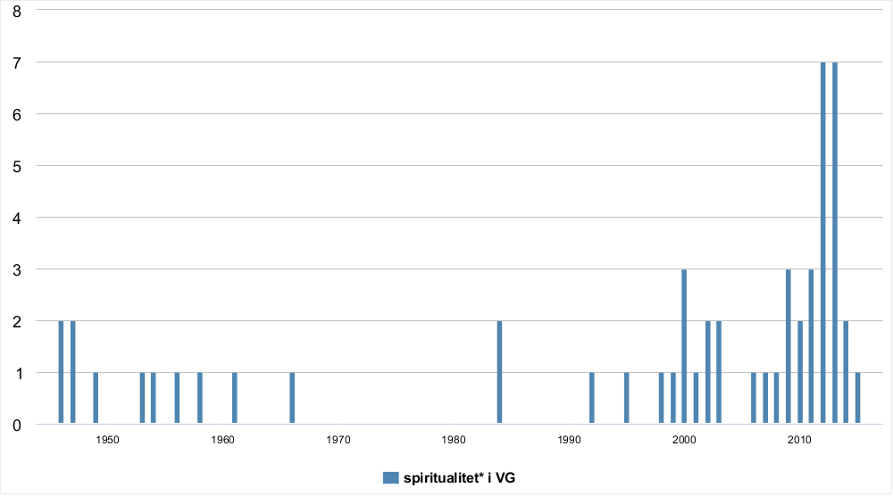

# 1950–2015: Engler, New Age og ikke-religion

## Tidsserier

Det som følger er en oversikt over forekomster av spiritualitetsklyngen i de ulike tekstkorpusene over tid. Det er viktig å påpeke at i første omgang reflekterer dette først og fremst antall forekomster i datamaterialet fordelt på år, og ikke en forholdsmessig bruksfrekvens. I Atekst er det for eksempel flere tilgjengelige søkekilder fra og med 90-tallet.

### Spiritualitet*

#### Atekst

#### Nasjonalbiblioteket

#### Norsk aviskorpus

### Spirituell*

#### Atekst

### Åndelighet*

### Åndelig*

## Konkordanser (KWIC)

### Spiritualitet

#### Norsk aviskorpus

Et søk på `".*spiritualitet.*" %c \ <>` i Norsk aviskorpus gir totalt 202 treff. Etter å tatt vekk duplikater står vi igjen med 192 unike linjer.

| Variant                   | Frekvens |
| -------                   | -------  |
| åndelighet/spiritualitet  | 1        |
| konsum-spiritualiteten    | 1        |
| liksom-spiritualitet      | 1        |
| ny-spiritualitet          | 1        |
| Olavs-spiritualiteten     | 1        |
| pinsevenn-spiritualiteten | 1        |
| selvspiritualitet         | 1        |
| spiritualitetens          | 1        |
| spiritualitetsform        | 1        |
| Økospiritualitet          | 2        |
| spiritualiteten           | 29       |
| spiritualitet             | 152      |
| Totalt                    | 192      |

### Åndelighet

Et søk på `".*åndelighet.*" %c \ <>` i Norsk aviskorpus gir totalt 418 treff, etter å ha fjernet duplikater 336 unike treff.

| Variant                  | Frekvens |
| ------------------------ | -------- |
| New Age-åndelighet       | 1        |
| åndelighet/spiritualitet | 1        |
| åndelighetsfilosofien    | 1        |
| åndelighetskitschen      | 1        |
| åndelighetslengsel       | 1        |
| rett-i-koppen-åndelighet | 1        |
| uåndelighet              | 1        |
| Ny-åndelighet            | 2        |
| nyåndelighetens          | 4        |
| åndelighetens            | 5        |
| nyåndeligheten           | 10       |
| nyåndelighet             | 15       |
| åndeligheten             | 35       |
| åndelighet               | 287      |
| Totalt                   | 365      |

## Kollokasjoner

### Åndelighet
| bigram           | frekvens |
| ---------------- | -------- |
| og åndelighet    | 39       |
| med åndelighet   | 5        |
| åndelighet -     | 3        |
| åndelighet kan   | 3        |
| all åndelighet   | 3        |
| åndelighet ``    | 9        |
| åndelighet og    | 39       |
| åndelighet ¶     | 8        |
| en åndelighet    | 11       |
| etter åndelighet | 5        |
| for åndelighet   | 17       |
| om åndelighet    | 15       |
| åndelighet .     | 59       |
| til åndelighet   | 4        |
| egen åndelighet  | 3        |
| av åndelighet    | 11       |
| i åndelighet     | 3        |
| at åndelighet    | 4        |
| tids åndelighet  | 3        |
| er åndelighet    | 3        |
| sin åndelighet   | 7        |
| åndelighet i     | 11       |
| slags åndelighet | 4        |
| åndelighet å     | 3        |
| åndelighet er    | 15       |
| , åndelighet     | 24       |
| åndelighet som   | 14       |
| åndelighet ,     | 59       |
| både åndelighet  | 3        |
| åndelighet blant | 3        |
| type åndelighet  | 3        |
| åndelighet eller | 4        |

### Alle kollokasjoner

#### Norsk aviskorpus

På søket `".*spiritualitet.*" %c \ <>` gir Norsk aviskorpus totalt 163 kollokasjoner fordelt på

### *s spiritualitet

#### Norsk aviskorpus

I Norsk aviskorpus finner vi kun fire kollokasjoner under søket `*s spiritualitet`.

<!--- 1   11589786- En annonse for fremtiden 01.09.98: Kvalitetskrav til forsvarere - Uten sosial praksis er åndsliv mindre interessant. Derfor er antroposofien blitt det mest fruktbare livssynet for meg. Her     forenes spiritualitet     med ansvar for medmennesker og samfunn, sier Cato Schiøtz. Den kjente skrankeadvokaten - med Per Liland-saken som ett av sine høydepunkter - er i Trondheim for å holde foredrag     AA  1998-11-10 -->
<!--- 2   205321333 --><!---     å gi dispensasjon. ¶ <U #http://www.fedrelandsvennen.no/regional/birkenes/97575.html> Søster Hedwig til Birkenes ¶ Birkenes Kirkeforum og Birkenes folkeakademi har invitert St. Joseph-søster Hedwig Osterhus til å snakke om Ignatius Loyola og -->    hans spiritualitet<!---     . Søster Hedwig er knyttet til St. Joseph Retrettsenter på Nesøya utenfor Oslo. Dit kommer mennesker fra ulike kirkesamfunn for å oppleve stille dager. Senteret gir åndelig veiledning -->    FV  2001-11-06
<!--- 3   800755835 --><!---     ved bare å studere læresetninger og dogmatikk er viktig. Man må også ta med den måten troen ytrer og manifesterer seg på i menneskers liv, det vi kan kalle -->    tradisjonens spiritualitet<!---     . Bjørneboes hovedpåstand er at der er en " fundamental forskjell " mellom muslimsk og kristen fromhet, der den første er utadvendt og den andre innadvendt. Problemet er bare -->    DB  2008-08-20
<!--- 4   800756086 --><!---     vel så stor avstand mellom det lov-orienterte og det mystisk/sufistiske islam som avstanden mellom islamsk og kristen mystikk. Og det er nettopp når man, som Bjørneboe, søker etter -->    tradisjonenes spiritualitet<!---     og konkrete fromhetsuttrykk at dette blir tydelig. Og de overraskende mange eksemplene på likhetstrekk, påvirkning og slektskap vil for øvrig også være det beste utgangspunkt for reell religionsdialog. -->    DB  2008-08-20
<!--- 5   954434721 --><!---     er haram, telles det som en dårlig gjerning. I tillegg er det slik at hva man spiser og forbruker har mye å si for ens forhold til Gud og -->    ens spiritualitet<!--     , mener Mohammad Usman Rana. Iført sine halalslips avstår Aftenposten-skribenten selv både fra Laban seigmenn og Bamsemums. - Fører den omfattende kartleggingen av produkter til økt press for å -->    DB  2010-02-10

### *s åndelighet

### spirituelle *

### åndelige *

## Synonymiseringer

### spirituatliet og *

### åndelighet og *

### spirituell og *

### åndelig og *

##Nøkkelord og tema-modeller
